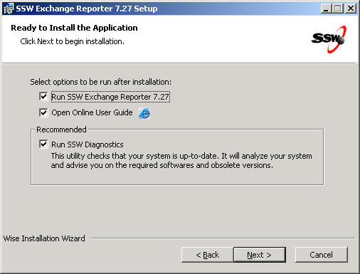
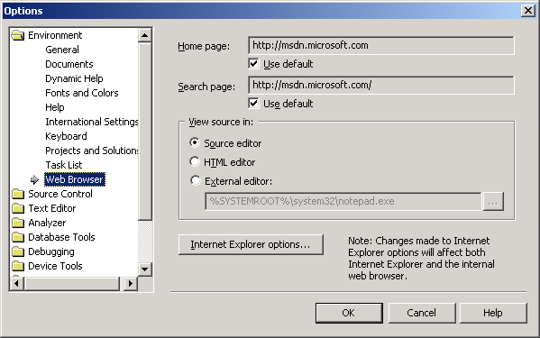
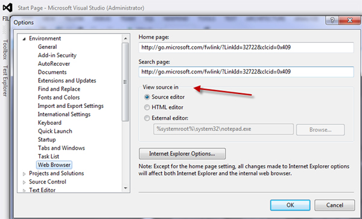

Group box should only be used when you want to notify the user the controls within it are really related, such as radio buttons.

 <excerpt class='endintro'></excerpt> 
​<dl class="badImage"><dt></dt>
<dd>Figure: Bad Example - Inappropriate use of 'Group Box', there is nothing to be grouped</dd></dl>
<dl class="goodImage"><dt></dt>
<dd>Figure: Good Example - Use a line to organize different sections</dd></dl>
<dl class="goodImage"><dt></dt>
<dd>Figure: Good Example - VS.NET 2003 Options form, appropriate use of 'Group Box', the radio buttons are related to each other</dd></dl>
<dl class="goodImage"><dt></dt>
<dd>Figure: Good Example - VS.NET 2012 Options form, also appropriate use of 'Group Box'</dd></dl>

In other cases, you should avoid using group box and replace it with a simple line, this will save you some space on the form and help you organize your form more easily.

