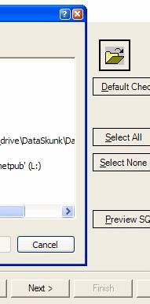

Question: What is wrong with this Picture?
<dl class="image">&lt;dt&gt;&lt;/dt&gt;
<dd>Figure: What is wrong?</dd></dl>
<!--endintro-->

 **Answer:** There are three different types of buttons in the Application:

* *Next >* - Default Window Style
* *Preview* - .NET Flat Style
* *Cancel* - Window XP Style

<dl class="image">&lt;dt&gt;&lt;/dt&gt;
<dd>Figure: Even labels need to use FlatStyle.System. Can you spot the wrong label?</dd></dl>
See our [Rules to Better Windows Forms](http://www.ssw.com.au/ssw/Standards/Rules/RulesToBetterWindowsForms.aspx#XPThemes) to implement XP Themes in .NET.

| We have a program called [SSW Code Auditor](http://www.ssw.com.au/ssw/CodeAuditor/Rules.aspx#ConsistentButtonStyle) to check for this rule. |
| --- |
