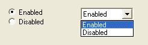
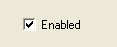
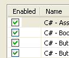
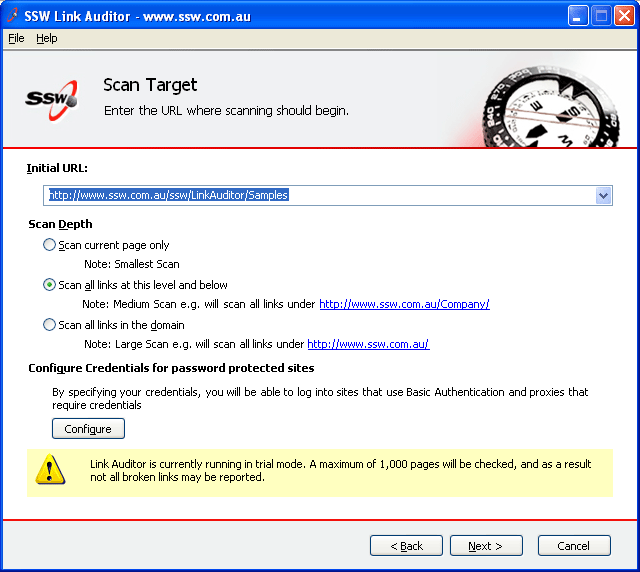
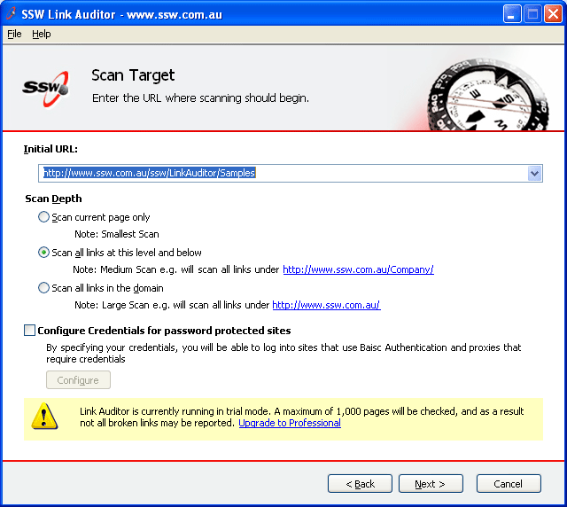
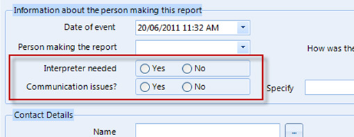
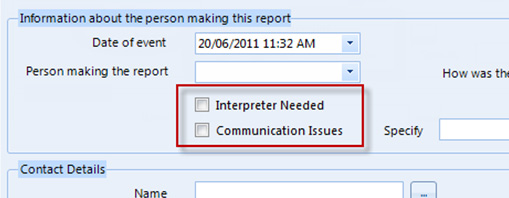

If the option only contains 2 choices, and the answer is a Boolean type value where the opposite value is clear (e.g. Enabled/Disabled, True/False, Yes/No, On/Off), it should always be a checkbox.
<dl class="badImage">&lt;dt&gt;&lt;/dt&gt;
<dd>Figure: Bad Example - Boolean options not using CheckBox</dd></dl><dl class="goodImage">&lt;dt&gt;&lt;/dt&gt;
<dd>Figure: Good Example - A CheckBox is used for Boolean type value</dd></dl>
<!--endintro-->

Only 1 CheckBox is used as the opposite value is clear, such controls are often CheckBoxes in a ListView too. E.g.:
<dl class="goodImage">&lt;dt&gt;&lt;/dt&gt;
<dd>Figure: Good Example - CheckBoxes in a ListView</dd></dl>
CheckBoxes are also suitable to use for enable or disable sections and to tell the user that these sections do not need configuring for the application to run.
<dl class="goodImage">&lt;dt&gt;&lt;/dt&gt;
<dd>Figure: Good Example - CheckBoxes are used (although no opposite values), because they are clear when the CheckBoxes aren't ticked, the sections are disabled</dd></dl><dl class="badImage">&lt;dt&gt;&lt;/dt&gt;
<dd>Figure: Bad Example - This screen implies that Configuring Credentials is required</dd></dl><dl class="goodImage">&lt;dt&gt;&lt;/dt&gt;
<dd>Figure: Good Example - This screen uses a CheckBox to signify that Configure Credentials is optional</dd></dl>
If there are only two options available on the form (usually a yes/no answer), the use of a checkbox is more intuitive than radio buttons. Only use radio buttons if there are more than two options.
<dl class="badImage">&lt;dt&gt;&lt;/dt&gt;
<dd>Figure: Bad Example – Radio buttons are not appropriate when there are only two options</dd></dl><dl class="goodImage">&lt;dt&gt;&lt;/dt&gt;
<dd>Figure: Good Example – These yes/no questions have a better representation with checkboxes</dd></dl>
