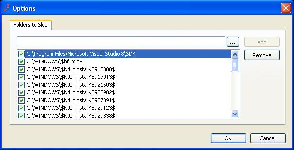
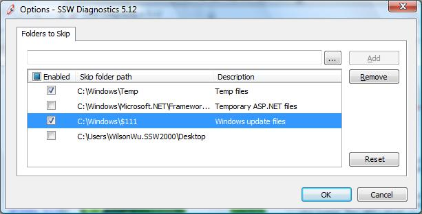

A GridView provides much richer features than ListBox, you can easily add a checkbox onto the header to allow "check all" functionality, which is impossible for ListBox.

<!--endintro-->
<dl class="badImage">&lt;dt&gt;&lt;/dt&gt;
<dd>Figure: Bad Example - Use the ListBox.</dd></dl><dl class="goodImage">&lt;dt&gt;&lt;/dt&gt;
<dd>Figure: Good Example - Use GridView and add the enabled checkbox on the header</dd></dl>
