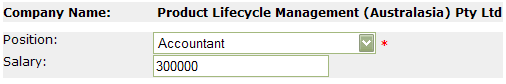

ComboBoxes are better than List Boxes  **for data entry** because:

* They occupy less screen space
* They are less trouble to scroll through, owing to the fact that you can afford to have more room for the list (as it's collapsed most of the time)
* As you can see in the figures below, using a combo also makes the required field indicator (\*) easier to see.

<!--endintro-->
<dl class="badImage">&lt;dt&gt;&lt;/dt&gt;
<dd>Figure: Bad Example - Using list boxes</dd></dl><dl class="goodImage">&lt;dt&gt;&lt;/dt&gt;
<dd>Figure: Good Example - Using ComboBoxes - takes up less screen space and the required field indication is easy to see</dd></dl>
 **Note: When are single-select list boxes OK?** 

As mentioned before, there are exceptions to this rule. It would be hard to imagine the Include/Exclude boxes in the SQL Server Enterprise Manager's Server Registration Wizard being handled with ComboBoxes, for example.
<dl class="image">&lt;dt&gt;&lt;/dt&gt;
<dd>Figure: Include/Exclude Listboxes are an example of a valid use for List Boxes</dd></dl>

| We have a program called [SSW Code Auditor](http://www.ssw.com.au/ssw/CodeAuditor/) to check for this rule. |
| --- |
