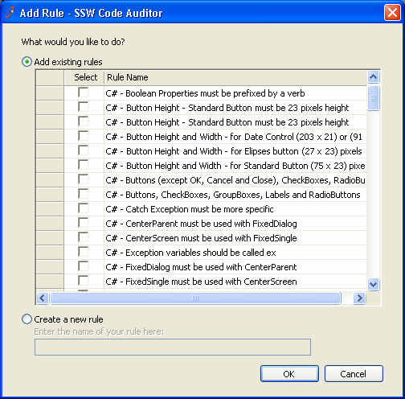
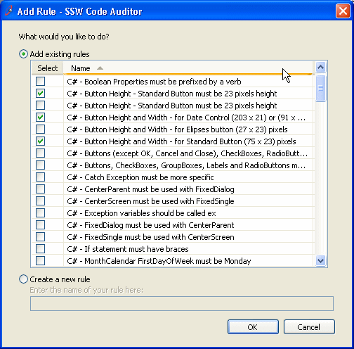
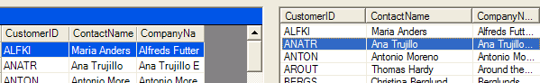
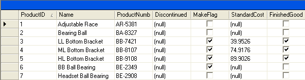

Yes a ListView looks nicer than a DataGrid, but a Datagrid is better because it has more functionality (out of the box that is). With a ListView you cannot:

<ul><li>Copy and paste - although you can select a row of data in both controls, you can't copy and paste a whole row from the ListView</li>
<li>Sort data - always useful when there are more than about 20 rows</li>
<li>DataBind - always saves heaps of code</li></ul>
 <excerpt class='endintro'></excerpt> 
​

So our old rule was to always use the ugly DataGrid (although we were never happy about that).
<dl class="badImage"><dt>  </dt><dd>Figure: Bad Example - The DataGrid is ugly</dd></dl><dl class="goodImage"><dt>  </dt><dd>Figure: Good Example - A beautiful ListView - a nicer look over the datagrid</dd></dl>
So the listview looks nicer? If you are not convinced here is another one:
<dl class="goodImage"><dt>  </dt><dd>Figure: Good Example - The appearance of DataGrid and ListView</dd></dl>
But another issue is how much code to write... For ListView you will need to write a bit of code to fill the list view...
<dl class="badCode"><dt>
this.listView1.Items.Clear(); // stops drawing to speed up the process, draw right at the end. this.listView1.BeginUpdate(); foreach(DataRow dr in this.dataSet11.Tables[0].Rows) { ListViewItem lvi = new ListViewItem(new string[] {dr[0].ToString(),dr[1].ToString(),dr[2].ToString()}); lvi.Tag = dr; this.listView1.Items.Add(lvi); } this.listView1.EndUpdate();
</dt><dd>Figure: 8 lines of code to fill a ListView</dd></dl>
But the datagrid is nicer to code... this is because it comes with data binding ability.
<dl class="badCode"><dt>
// bind it in the designer first. this.oleDbDataAdapter1.Fill(this.dataSet11);
</dt><dd>Figure: One line of code to fill a DataGrid</dd></dl>
But the SSW ListView (included in the <a href="http://www.ssw.com.au/ssw/NETToolkit/">.NET Toolkit</a>) is nicer to code with as it comes with data binding ability.
<dl class="goodCode"><dt>
// bind it in the designer first. this.oleDbDataAdapter1.Fill(this.dataSet11); 
 </dt><dd>Figure: One line of code to fill the SSW ListView</dd></dl>
So what is this SSW ListView?

It is an inherited control that how we implemented the ListView to give us what MS left out.
<ul><li>DataBinding</li><li>Sorting</li></ul>
So now the rules are:  Always use the SSW ListView.  Exception: Use the DataGrid when:
<ul><li>When not read only - i.e. users will be editing data directly from the cells.</li><li>You need more than 1 column with checkboxes, or the column with checkboxes can't be the first column. E.g.: <dl class="image"><dt>  </dt><dd>Figure: One place when you choose a DataGrid over a ListView is when you have 2 checkbox fields</dd></dl></li></ul>
So in summary, if you don't want users to edit the data directly from the cell, and only the first column need checkboxes, then the ListView is always the better choice.
<table cellspacing="2" cellpadding="2" summary=".NET Toolkit" class="clsSSWProductTable"><tbody><tr><td>We have an example of this in the <a href="http://www.ssw.com.au/ssw/NETToolkit/"> SSW .NET Toolkit</a>.</td></tr></tbody></table> 
 
<table cellspacing="2" cellpadding="2" summary="Code Auditor" class="clsSSWProductTable"><tbody><tr><td>We have a program called <a href="http://www.ssw.com.au/ssw/CodeAuditor/">SSW Code Auditor</a> to check for this rule.</td></tr></tbody></table> 
 

Note: We have a suggestion for Microsoft to improve the <a href="http://www.ssw.com.au/ssw/Standards/BetterSoftwareSuggestions/MSForm.aspx#DataGridsFormattingonCopy">copy and paste format from a gridview</a>

