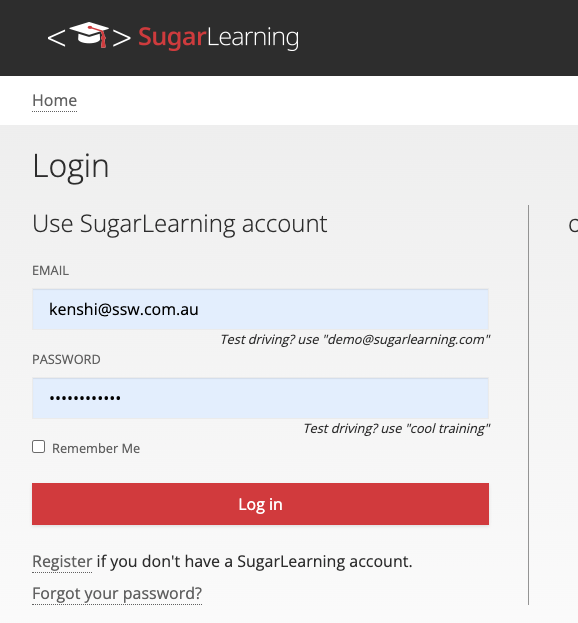
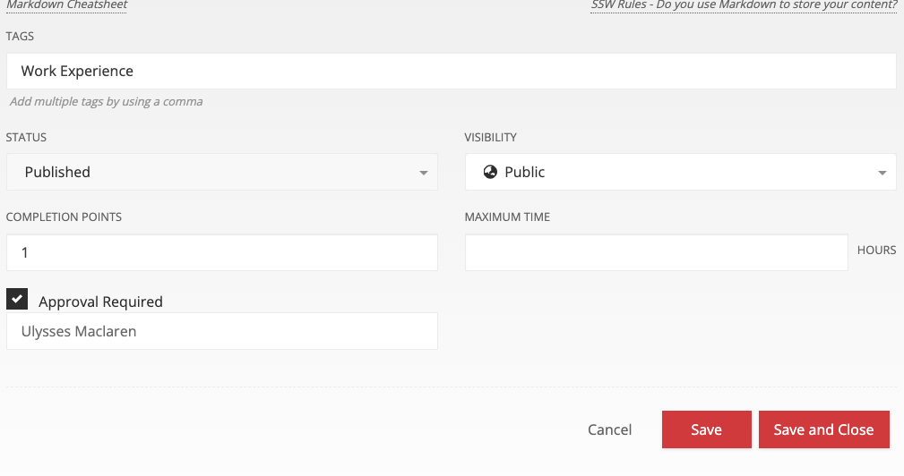
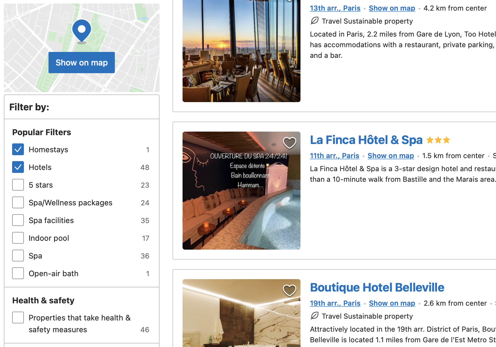

Checkboxes are presented as small square box in user interfaces. It has two states: checked and unchecked. 

<!--endintro-->

### When to use checkboxes in UI design

Checkboxes are used in forms and databases to indicate an answer to a question, apply a batch of settings or allow the user to make a multi-selection from a list. Alternatively, a single checkbox may be used for making single selections – such as Boolean True or False statements (e.g. “Do you agree with the terms and conditions? Yes or no”).

::: good\

:::

CheckBoxes are also suitable to use for enable or disable sections and to tell the user that these sections do not need configuring for the application to run.

::: good\

:::

Checkboxes allow the user to select one or more from a  wide range of options. Applications use a series of checkbox groups to help the user filter search criteria.

::: good\

:::

If there are only two options available on the form (usually a yes/no answer), the use of a checkbox is more intuitive than radio buttons. Only use radio buttons if there are more than two options.