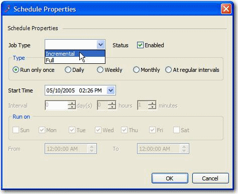
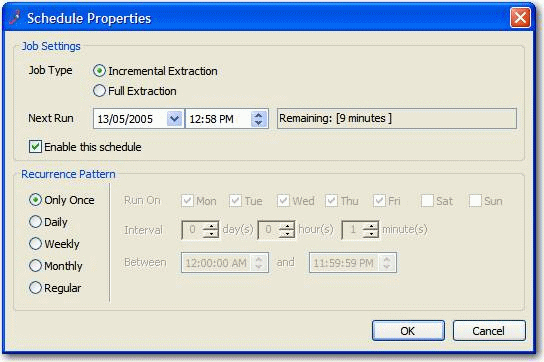

Checkboxes are presented as small square box in user interfaces. It has two states: checked and unchecked.

<!--endintro-->

### When to use checkboxes in UI design

Checkboxes are used in forms to indicate an answer to a question, apply a batch of settings or allow the user to make a multi-selection from a list. Alternatively, a single checkbox may be used for making single selections – such as Boolean True or False statements (e.g. “Do you agree with the terms and conditions? Yes or no”).

::: good

:::

CheckBoxes are also suitable to use for enable or disable sections and to tell the user that these sections do not need configuring for the application to run.

::: good

:::

Checkboxes allow the user to select one or more from a  wide range of options. Applications use a series of checkbox groups to help the user filter search criteria.

::: good

:::

If there are only 2 options available on the form (usually a **yes/no** answer), the use of a checkbox is more intuitive than radio buttons. Usually, use radio buttons if there are more than 2 options; or if the labels information are more complex than a yes/no.

### When to use options group Radio Buttons instead of ComboBox?

When the options are static items (not database driven) and they can fit on the screen (about 2-5 items), they should be radio buttons.

The bad thing about having a ComboBox in this scenario is the user needs 2 clicks to change the value...

1. Click the little "v" button to see the available options
2. Then click the option to select

::: bad

:::

The good thing about an options group is that the user can see all the available options without clicking, and select the option with just 1 click.

::: good

:::
