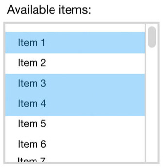
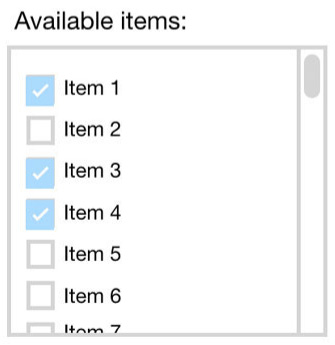

For multiple items selection, **multi-select dropdown listboxes** have a number of behavioral quirks that make it difficult for users to get used to them:

* They require users to know that you select more than one entry by holding down the **Ctrl** key
* They lose all selections if you click in the wrong place
* You can't tell if a Listbox is single-select or multi-select at first glance

<!--endintro-->

::: bad

:::

**Note:** It is OK and recommended to use dropdown lists for single item selection, when there is no more than 10 options.

**Checked Listboxes** are the ideal alternative for multiple items selections. They're much more pleasant to use and are a good deal more intuitive - compare to the list above. Checked Listboxes tell users immediately that they have the ability choose multiple options.

* In ASP.NET, use **System.Web.UI.WebControls.CheckBoxList**. If you're having problems with there being too many items in the list, use a **scrolling div**
* In Windows Forms, use **System.Windows.Forms.CheckedListBox**

::: good

:::

We have a program called  [SSW Code Auditor](https://www.ssw.com.au/ssw/codeauditor/) to check for this rule.
