Control4 Agents are essential components of a smart home system that automate various tasks and functions.             

<!--endintro-->

### Advanced Lighting

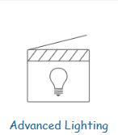

This agent allows for advanced lighting control, such as creating custom lighting scenes and schedules e.g. you can orchestrate ramping up the level of lights from 0 to 100% over 5 seconds to create a nice mood.

::: good
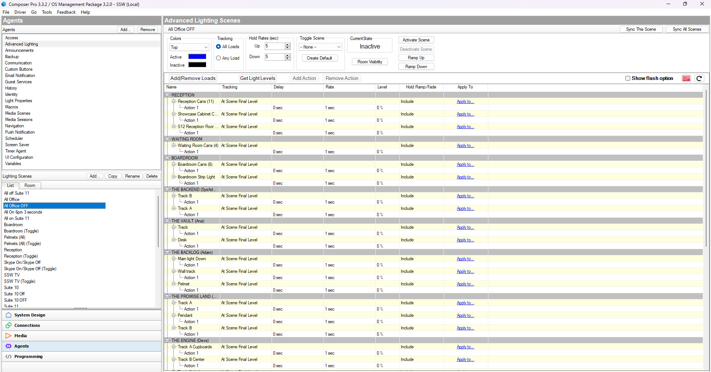
:::

### Scheduler

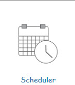

Schedules events, used for automation triggers e.g. at 6pm you could have all the lights in your office blink to remind people to go home.

::: good
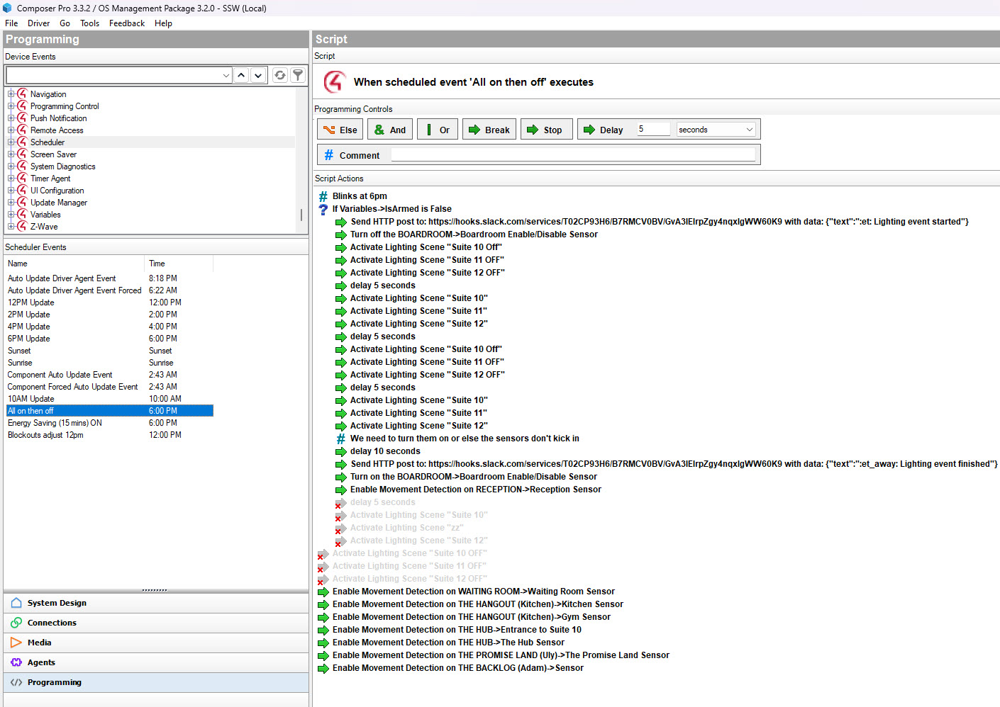
:::

### Communication

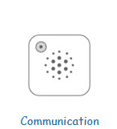

Provides communication capabilities between Control4 devices and other systems, such as security systems and intercoms e.g. you can talk to people at your door from your Control4 touchscreen.

### Announcements

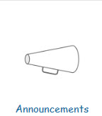

Allows users to create custom announcements and messages, which can be played through speakers throughout the home.

### Macros

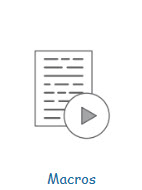

Allows users to create custom macros, which are groups of actions that can be triggered with a single command e.g. play a playlist every time a different keypad button is pressed around your house, make a shutdown event that can be triggered by different devices on the office

::: good
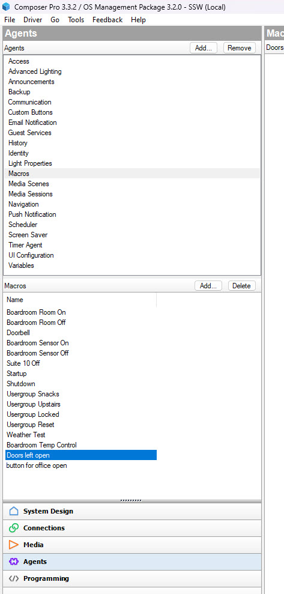
:::

### Wake/Sleep

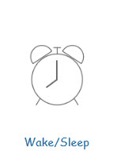

Provides “Alarm Clock” and “Sleep Timer” functionality e.g. get an alarm going at 6 in the morning in the bedroom to wake up your family!

### Navigation

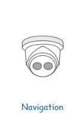

Provides a programming pathway for camera feeds e.g. you can show the doorbell camera on your Control4 touchscreen when someone walks by your door.

### Custom Buttons

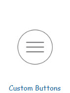

Allows users to create custom buttons, which can be programmed to trigger specific actions or events e.g. you don't need to have physical keypads only, you can also add keypads in the Control4 app and touchscreens and customize it the way you want!

::: good
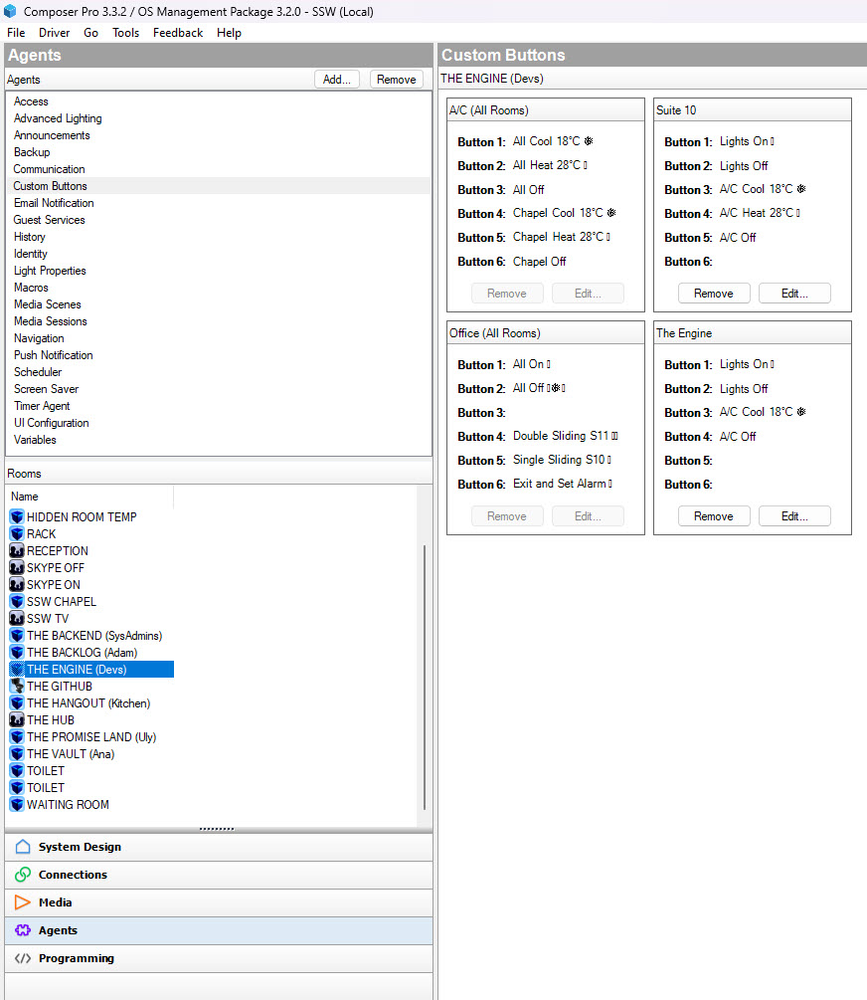
:::

By using Control4 Agents, users can customize and automate their smart home system to fit their specific needs and preferences.
