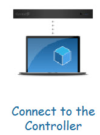
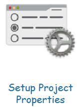
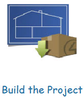
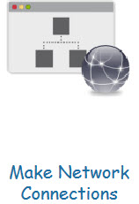
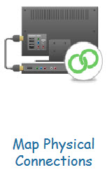
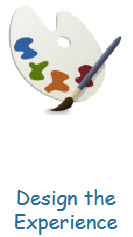

Control4 is a home automation system that allows you to control devices in your home from a single platform.
The Control4 Project Creation process involves several stages and steps, including connecting the Controller, adding devices, creating rooms and scenes, programming the system, and testing and troubleshooting.
Each stage includes several steps necessary to create a customized Control4 system.

You'll do most of the steps below in **Composer Pro**, the Control4 Director.

<!--endintro-->

Follow these stages and steps in order on project creation:

## Stage 1 - Connect to the Controller

**Step 1: Add the Controller**   
Discover the Controller in the Composer software using Simple Device Discovery Protocol (SDDP).

**Step 2: Create the Customer's Account**    
Register the customer's account on the Control4 website.

**Step 3: Register the Controller**  
Register the controller online.

---

## Stage 2 - Set Up Project Properties

**Step 4: Set Project Information**   
1. Open the Composer software and create a new project.
2. Provide a project name, location.

**Step 5: Set Customer Information**  
Provide the customer information in the project.

**Step 6: Set Lighting Defaults**  
Configure the lighting color defaults based on the customer's preference.

---

## Stage 3 - Build the Project

**Step 7: Add Rooms**    
Create a list of all the rooms in the customer's home that will be controlled through the Control4 system e.g. Kichen, Bedroom, Foyer.

**Step 8: Add Drivers**   
Add the different drivers to control the different devices in the project.

**Step 9: Configure Driver Properties**   
Tweak and change the driver properties for each device - don't forget to read the documentation for each driver!

---

## Stage 4 - Make Network Connections

**Step 10: Identify IP Devices**  
Identify the IP devices in the system via the Network tab in Composer.

**Step 11: Turn On Zigbee**   
Turn on your Zigbee controller, so you can start identifying Zigbee devices.

**Step 12: Identify Zigbee Devices**   
Start joining your Zigbee devices into the project by the 4-tap method.

## Stage 5 - Map Physical Connections

**Step 13: Make Control/AV Connections**  
Connect your devices to each other via the various available connections in each.

**Step 14: Make Room Endpoint Connections**  
Determine which devices are your endpoints in each room.

---

## Stage 6 - Design the Experience

**Step 15: Interact with the client**  
An iterative process where the installer works together with the client to give them the best interface and home experience.

* **Navigator Configuration**  
  Configure the Control4 app and screens to give the expected and best experience to the client.

* **Driver Connections**  
  Connect drivers and loads together to seamslessly automate the building.

* **Agents**  
  Use agents to extend Control4 functionality.

* **Programming**   
  Program and design the automation and interactions.
