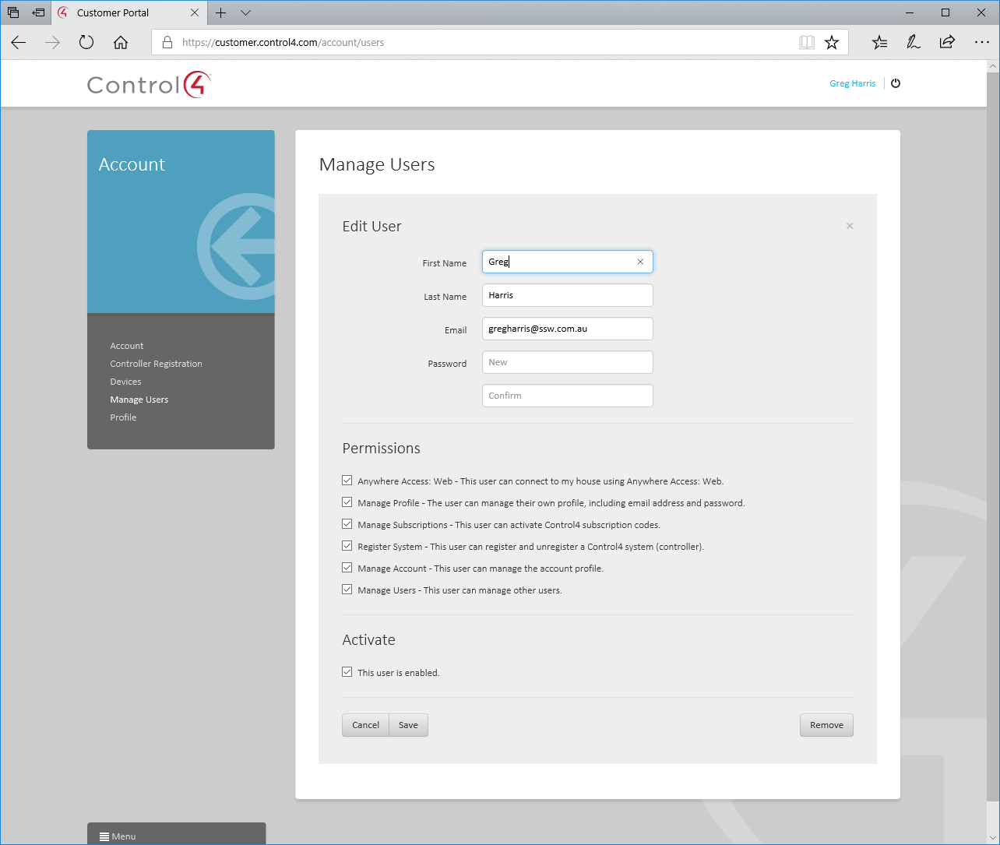

​Some companies incorrectly share a user account and many people use it. This is easy initially but creates problems later on. 

 <excerpt class='endintro'></excerpt> 

Each user should use their own account. If users share a single account, and you need to remove their access, you would then have to change the password and inform all other users. 

If everyone is using an individual account, it is as simple as disabling (or deleting) their account. 

 

​ 

<strong>Figure: Use the Customer Portal to add accounts for all users</strong>  

