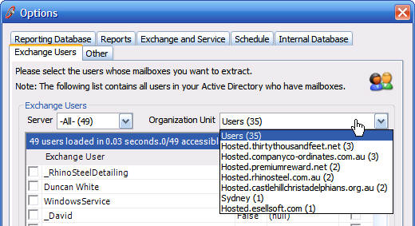
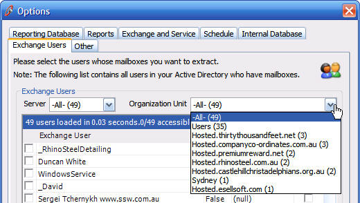
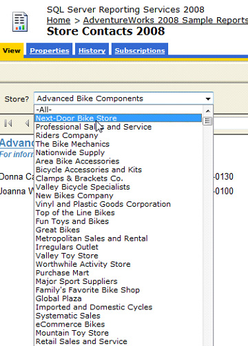
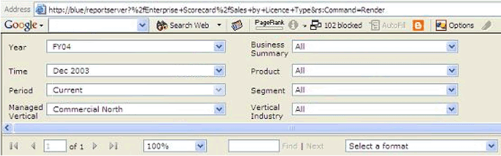

ComboBoxes are often used for filtering data. It is best to have an '-All-' option to give your user chances to select all data.

It is important to understand the idea of  **visual text** . In a list you could see either:

* -None- or
* No activity assigned

They both have the same meaning, but the first one is immediately visible whereas the second one must be read.

<!--endintro-->

If the ID column in your database is a string data type, it is useful to add a constraint to limit the types of characters that it can contain. Adding a constraint can make it simpler to build your front-end, as you won't need to worry about encoding or escaping to handle special characters.

In SQL Server, you can add a check constraint that limits your column to alphanumeric characters, a hyphen, or underscore using the following T-SQL:

ALTER TABLE [TableName] ADD CONSTRAINT CK\_String\_Identifier
    CHECK ([StringIdColumn] NOT LIKE'%[^a-zA-Z0-9\_\-]%')

<dl class="badImage"><dd>Figure: Bad Example - No '-All-' option so the user cannot select all data</dd></dl><dl class="goodImage">&lt;dt&gt;&lt;/dt&gt;
<dd>Figure: Good Example - Having an '-All-' option gives a user a chance to select all data</dd></dl>
Also, keep it simple!
<dl class="badImage">&lt;dt&gt;&lt;/dt&gt;
<dd>Figure: Bad Example - '-All Stores-' isn't needed</dd></dl><dl class="goodImage">&lt;dt&gt;&lt;/dt&gt;
<dd>Figure: Good Example - Keep it as a simple '-All-'</dd></dl><dl class="goodImage">&lt;dt&gt;&lt;/dt&gt;
<dd>Figure: Good Example - Keeping it simple makes it easy to spot (that there is no filter) when you have multiple fields.</dd></dl>
Read our rule on [Always make sure the dimensions All Captions = All](http://www.ssw.com.au/ssw/Standards/Rules/RulesToBetterBusinessIntelligence.aspx#AllDimensionsTag).
