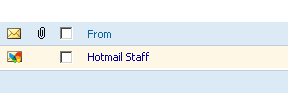
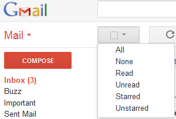
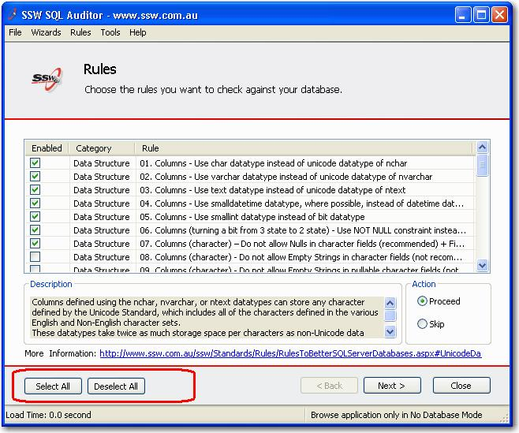
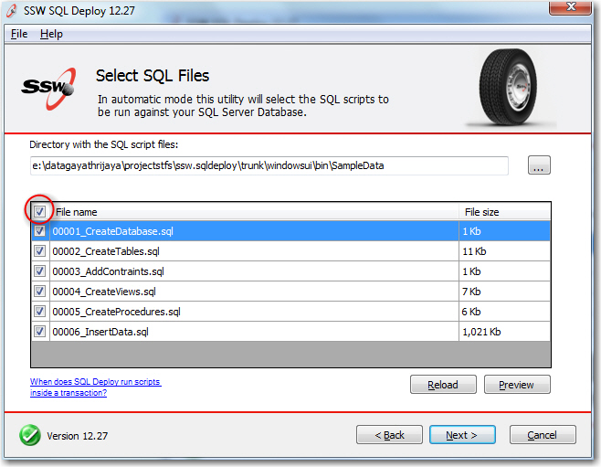
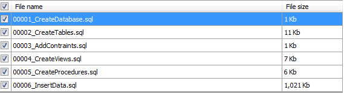
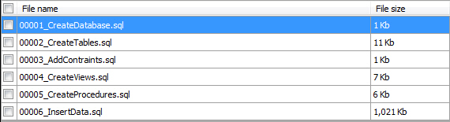
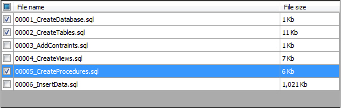
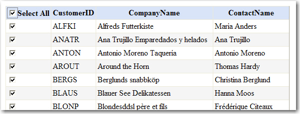

​​Do you have checkbox (on the top) that let users select or unselect all checkboxes underneath it? If you have a list of checkboxes, you are going to frustrate users unless you provide an easy way to select all. The best way to achieve this is to have a checkbox at the top. 

 <excerpt class='endintro'></excerpt> 
​ 
<dl class="goodImage"><dt>  </dt><dd>Figure: Good Example - Hotmail does this</dd></dl><dl class="image"><dt>  </dt><dd>Figure: Google have done it a different way to provide multiple methods (All, All Read, All Unread, All Starred, and All Unstarred)</dd></dl><dl class="badImage"><dt>  </dt><dd>Figure: Bad Example - SQL Auditor - No CheckBox for users to perform a "select all"</dd></dl><dl class="goodImage"><dt>  </dt><dd>Figure: Good Example - SQL Auditor - CheckBox at the top of the column</dd></dl><dl class="image"><dt>  </dt><dd>Figure: Selecting all does this - selects all</dd></dl><dl class="image"><dt>  </dt><dd>Figure: Deselecting all does this - selects none</dd></dl><dl class="image"><dt>  </dt><dd>Figure: Selecting some should show the Indeterminate check state - aka customized selection</dd></dl><dl class="code"><dt>
Private Sub CheckBoxSelectAll_CheckedChanged(ByVal sender As System.Object, ByVal e As System.EventArgs) _ Handles CheckBoxSelectAll.CheckedChanged 'Select checkbox in each row For Each sDataGridViewRow As DataGridViewRow In Me.DataGridViewCustomer.Rows sDataGridViewRow.Cells(0).Value = Me.CheckBoxSelectAll.Checked Next End Sub
</dt><dd>Code: Code for selecting all checkboxes in a windows form</dd></dl><dl class="image"><dt>  </dt><dd>Figure: Select all checkboxes in a web form</dd></dl><dl class="code"><dt>
​ 
 </dt><dd>Code: Code for selecting all checkboxes in a web form</dd></dl>
We have suggestions for Visual Studio .NET about this at <a href="http://www.ssw.com.au/ssw/Standards/BetterSoftwareSuggestions/MSForm.aspx#SelectAllCheckWindows">A top CheckBox to "select all" in windows forms</a> and <a href="http://www.ssw.com.au/ssw/Standards/BetterSoftwareSuggestions/MSAjax.aspx#SelectAllCheckWeb">A top CheckBox to "select all" in web forms.</a>

