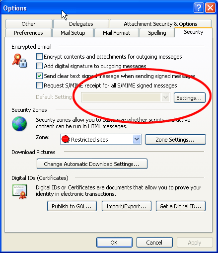
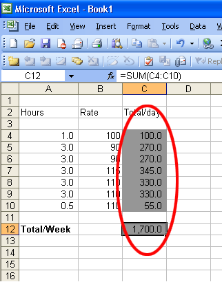

When you are not able to edit a field the field should be greyed out. This visually indicates to the user that the field cannot be changed.

 <excerpt class='endintro'></excerpt> 
​
If you are using Word or Excel, actually locking cells or tables may not be what you require, but you still want to prevent people from directly editing calculations. So make the cells grey and the visual indication should prompt the users what to do.

<dl class="goodImage"><dt></dt>
<dd>Figure: Good Example - Read only fields should be greyed out</dd></dl>
<dl class="goodImage"><dt></dt>
<dd>Figure: Good Example - Calculated Fields in Excel should be in Grey</dd></dl>

Of course you should follow the converse, which requires making all editable fields white.

