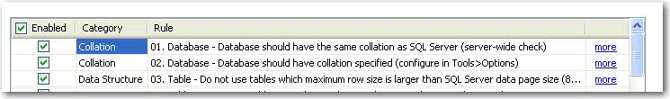
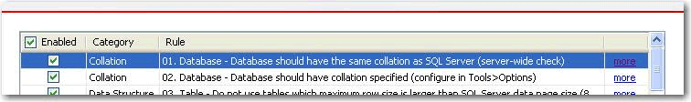

If you use the DataGridView control which is read only, you had better set row select mode as "FullRowSelect". If the data cannot be modified we can let users select the whole row instead of one column.

 <excerpt class='endintro'></excerpt> 
​<dl class="badImage"><dt></dt>
<dd>Figure: Bad Example - Row select mode is not "FullRowSelect".</dd></dl>
<dl class="goodImage"><dt></dt>
<dd>Figure: Good Example - Row select mode is "FullRowSelect".</dd></dl>
<dl class="image"><dt></dt>
<dd>Figure: Changed row select mode to FullRowSelect.</dd></dl>

What's the next step? It's even better if you enable multiple row selection and copying, see <a href="http://www.ssw.com.au/ssw/Standards/Rules/RulesToBetterWindowsForms.aspx#ListView">Do your List Views support multiple selection and copying</a> on <a href="http://www.ssw.com.au/ssw/Standards/Rules/RulesToBetterWindowsForms.aspx">Rules to Better Windows Forms Applications</a>.

