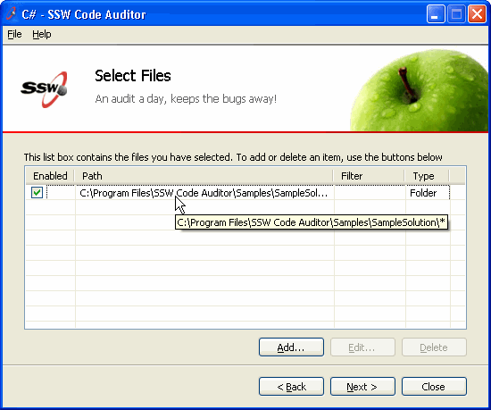

When you can't see all the text for an item in a ListView you need to expose the full text via a ToolTip.

<!--endintro-->
<dl class="badImage">&lt;dt&gt;
      
   &lt;/dt&gt;<dd>Figure: Bad Example - Users can't see all the text and the ListView doesn't use a Tooltip</dd></dl><dl class="goodImage">&lt;dt&gt;
      
   &lt;/dt&gt;<dd>Figure: Good Example - Users can't see all the text, but the ListView shows all the text via a Tooltip</dd></dl>
The code to do this is:
<dl class="code">&lt;dt&gt;
private ListViewItem hoveredItem;  private void listView1_MouseMove(object sender, MouseEventArgs e)  {   ListView lv = (ListView) sender;   ListViewItem item = lv.GetItemAt(e.X, e.Y);  int columnIndex = 1;  if (item != hoveredItem)  {   hoveredItem = item;   if (item == null)   {   toolTip1.SetToolTip(lv, "");   }   else   {   // Make sure the mouse hovered row has the subitem   if (item.SubItems.Count > columnIndex)  {   toolTip1.SetToolTip(lv, item.SubItems[columnIndex].Text);  }   else   {   toolTip1.SetToolTip(lv,"");   }   }   }   } 
&lt;/dt&gt;</dl>
