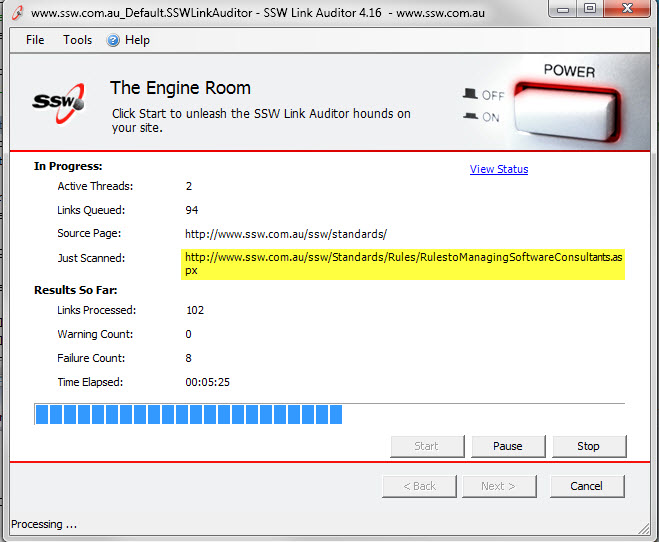
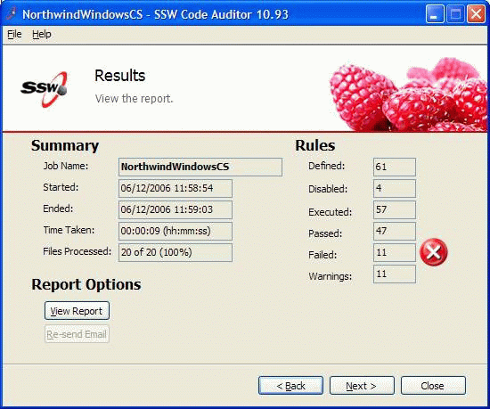

Use Label controls to display static text of the application. Eg. "Customer ID:" Use Text Box controls to display data (results of calculations, information, records from a database, etc.).

 <excerpt class='endintro'></excerpt> 
​
The reasons are:

<ul><li>users know it is data, not a label of the application</li>
<li>users can copy and paste from the field</li></ul>

PS: One reason web UI's are nice, is that the information is always selectable/copyable.

<dl class="badImage"><dt></dt>
<dd>Figure: Bad Example - Not only is the data cut off when you are using label, but you can't copy and paste the value</dd></dl>
<dl class="goodImage"><dt></dt>
<dd>Figure: Good Example - Using Textbox controls makes the data obvious to users</dd></dl>

As you can see you'll barely know the difference, so start using Textboxes for displaying data, that's good practice.

<h4>More Information</h4>

When using TextBox controls in Windows Forms, set them up like this:

<dl class="image"><dt></dt>
<dd>Figure: Having the 'BorderStyle' Property set to Fixed3D is the best choice visually</dd></dl>
<dl class="image"><dt></dt>
<dd>Figure: Make the text box Read-Only (users copying data is OK, changing is silly)</dd></dl>

