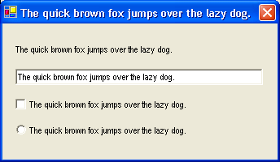
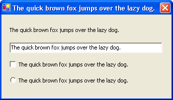
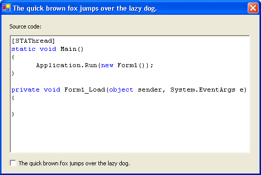

Some font are easier to read then others, at SSW we follow Microsoft's [Visual Design Guidelines](http://www.ssw.com.au/ssw/Redirect/Microsoft/MSDNInterfaceText.htm). This means we use Tahoma 8pt as our font of choice.

<!--endintro-->

At SSW, we use Code Auditor to ensure all fonts on our forms are set to Tahoma but we allow controls to use a different font. This is because certain information is better displayed in a different font. For example a Textbox to show code should use Courier instead of Tahoma.
<dl class="badImage">&lt;dt&gt;&lt;/dt&gt;
<dd>Figure: Bad Example - This form uses a non-standard font, and it is hard to read</dd></dl><dl class="goodImage">&lt;dt&gt;&lt;/dt&gt;
<dd>Figure: Good Example - This form uses Tahoma, and it is easy to read</dd></dl><dl class="goodImage">&lt;dt&gt;&lt;/dt&gt;
<dd>Figure: Good Example - This form uses Tahoma, and the RichTextBox displays source code using Courier New</dd></dl>

| We have a program called [SSW Code Auditor](http://www.ssw.com.au/ssw/CodeAuditor/Rules.aspx#VBFont) to check for this rule. |
| --- |
