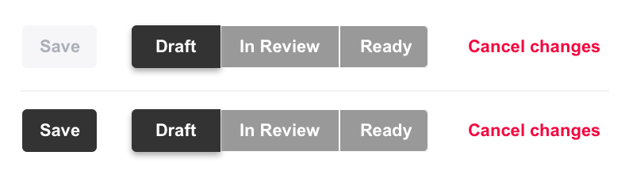

A button should be disabled if it is unavailable, if clicking it would generate an error message, or if it would carry out no function. However, buttons should not be hidden from view simply because they are unavailable, as it confuses the user.
<!--endintro-->

Different button states must have clear and distinct styling that differentiates them from each other and emphasizes them through the creation of a visual hierarchy. 

When buttons are in a disabled state the accepted standard is to “grey it out”. Using colour to create contrast like this serves to lower the emphasis on disabled buttons in favour of active ones. Lowering opacity or outline-only greyed buttons are other common ways to indicate a disabled state (Note the latter is only effective if outline buttons are not present elsewhere in the UI). Disabled buttons should also never display on-hover or on-click styles, to further convey their disabled state to the user. 

::: bad  
  
:::

::: good
  
:::
