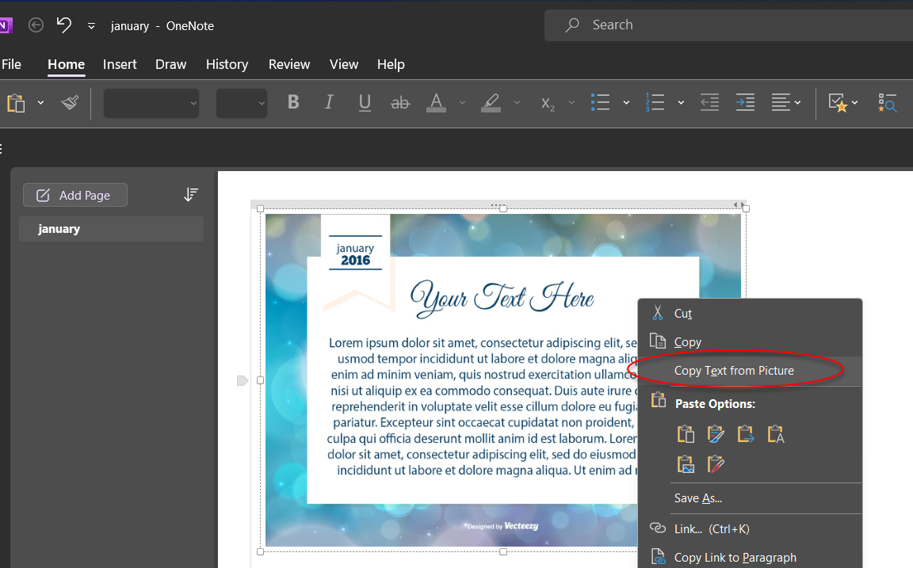
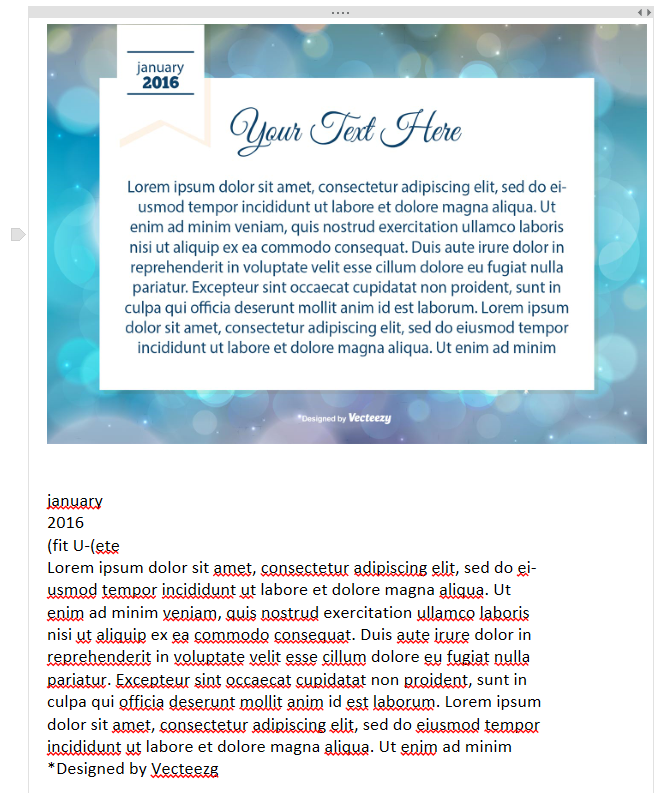
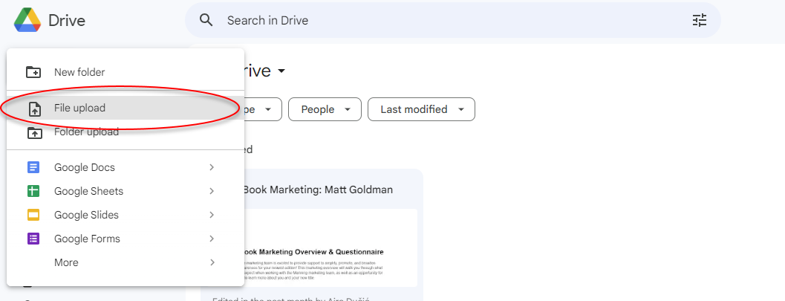
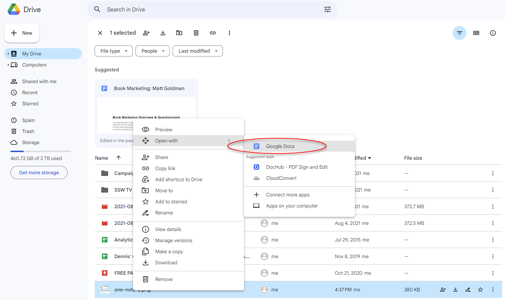
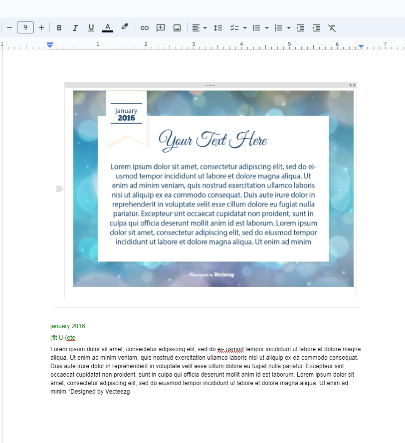

Have you ever stumbled upon a useful chart, diagram, or infographic with embedded text, only to find that the text can't be copied? This is incredibly frustrating because the information is locked in an image format. The process of manually typing out the text can be time-consuming and prone to errors. There are a couple ways to solve this:

<!--endintro-->

### Method 1: Using OneNote

Using OneNote is simple. All you do is paste your image into OneNote, right click on it, and click **Copy Text from Picture**.

::: large

:::

::: good

:::

### Method 2: Using Google Drive

In Google Drive you need to upload your image as a new file. Then you need to right click on the image file and select ** Open with | Google Docs**.

::: large

:::

::: large

:::

::: good

:::
