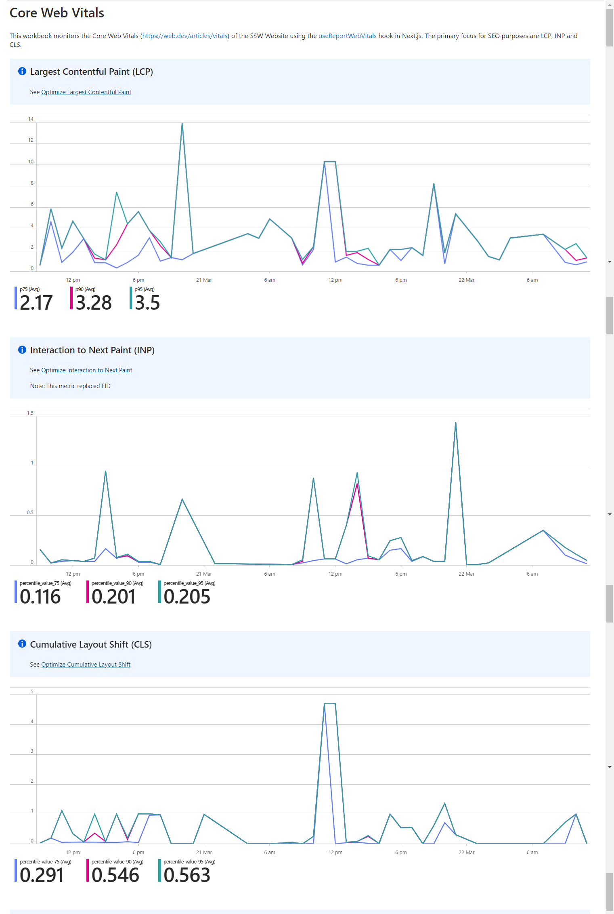

Core Web Vitals are super important metrics to measure how good your page's performance is. It's also incredibly important to how Google ranks page results.

<!--endintro-->

The most important Core Web Vitals at time of writing is [Largest Contentful Paint (LCP)](https://web.dev/lcp/), [Interaction To Next Paint (INP)](https://web.dev/inp) and [Cumulative Layout Shift (CLS)](https://web.dev/cls/).

## Types of Web Vitals

### Largest Contentful Paint (LCP)

LCP measures the time it takes for the largest element in the current viewport to load, i.e. is measuring how long it takes most of the page to load. Read more on [Google's page on Largest Contentful Paint (LCP)](https://web.dev/articles/lcp).

### Interaction To Next Paint (INP)

INP measures the responsiveness of the page, i.e. the latency when you interact with elements on the page. Read more on [Google's page on Interaction To Next Paint (INP)](https://web.dev/articles/inp).

### Cumulative Layout Shift (CLS)

CLS measures how much elements have shifted on the page from the first load. For example, adding an element after a `fetch` call has completed will result in a higher CLS value. Read more on [Google's page on Cumulative Layout Shift (CLS)](https://web.dev/articles/cls).

## Measuring Web Vitals

### Framework-Agnostic (web-vitals)

To capture these metrics in most frontend environments, you would use the `web-vitals` npm package.  

```js
import { onCLS, onFID, onLCP } from 'web-vitals';

function sendToTracker (metric) {
  // Send to an aggregate of your choice i.e. Azure App Insights, Google Analytics, Sentry, etc.
}

onCLS(sendToTracker);
onFID(sendToTracker);
onLCP(sendToTracker);
```

### Next.js

Next.js has a built in custom React hook to track vitals, with additional information relating to Next.js performance such as hydration and rendering time.

```js
import { useReportWebVitals } from 'next/web-vitals'

function App {
  useReportWebVitals((metric) => {
    switch (metric.name) {
      case "CLS":
      case "FID":
      case "LCP":
      case "Next.js-hydration":
      case "Next.js-render":
        // Send to an aggregate of your choice i.e. Azure App Insights, Google Analytics, Sentry, etc. 
        break;
    }
  });

  return <>{/* ... */}</>
}
```

## Using Web Vitals Data

When ingesting Core Web Vitals data, it's important to extract only the important information - as this data will likely be coming from every page visitor.

The primary focus of optimization work should be focused on the 75th percentile of the worst scores, as that usually represents the average device that users will be accessing your site on. It's also important to focus on improving higher percentiles, such as the 90th (P90), 95th (P95) and 99th (P99).

There are a variety of services that you can use for collecting data Core Web Vitals data:

* Sentry - see [Sentry's marketing page on monitoring Web Vitals](https://sentry.io/for/web-vitals/)
* Google Analytics - see [Google's how-to page on monitoring Web Vitals with GA4 and BigQuery](https://web.dev/articles/vitals-ga4)
* Azure Application Insights - see the [Microsoft documentation on metric tracking with App Insights](https://learn.microsoft.com/en-us/azure/azure-monitor/app/api-custom-events-metrics)

To track this data on App Insights you can use `trackMetric`:

```ts
applicationInsights.trackMetric(
  { name: "CLS", average: metric.value }, 
  { page: currentPagePath }
);
```

::: good

:::
