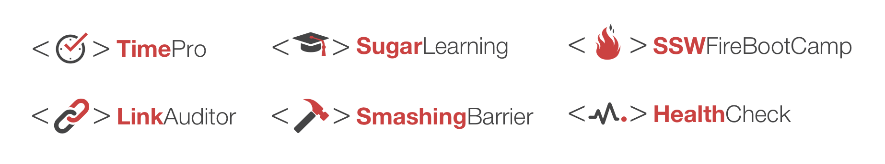

Logo design is an extremely important part of establishing a strong brand for a product or service. An effective product logo should have a unique design that incorporates a brand's core visual language and colors, and makes a lasting positive impression on users or customers.

<!--endintro-->
 

::: good
Figure: Good Example - Some of the current SSW Product Logos

:::

The following are great ways to establish a recognisable product logo:

### 1. Color

One of the easiest ways to start creating consistency is by forming a color palette. Most brands have one primary color they're most known for, and other colors that compliment it. 

The primary colors for SSW are always reflected in our logos:

- Red: #CC4141 | RGB (204,65,65)
- Charcoal: #333333 | RGB (51,51,51)

### 2. Typography

Type is another great way to establish strong and consistent branding across different products. It's more subtle than color, but customers and consumers can very quickly notice when your typography is inconsistent! 

The font used on an SSW product logo is **Helvetica Neue LT Pro**, the font weight for the first part of the product name is **75 Bold**, for the second part of the product name it's **45 Light**. 

### 3. Consistent elements and imagery

Creating a template for product logos is an easy way to save time during the design process while enforcing consistent branding. For example, an SSW product logo always has three parts: a pair of angle brackets, a unique icon, and the product name.  

### 4. Logo variations

An ideal logo design should take into account the different environments or formats they might be placed in. SSW product logos can all be found in 4 different color variations: Two-Colored, SSW charcoal, true black, or all white. 

::: good

:::

Logos should also have variations that allow the logo to fit different shapes or layouts. If needed, we can stack our icons and product name vertically, make the product name 80% of the original size (e.g. 30pt for original, 24pt for vertical) and then center align the elements to create a vertical version of a product logo.

::: good

:::
