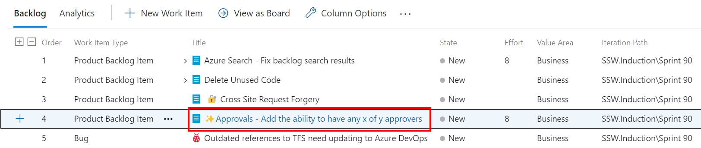
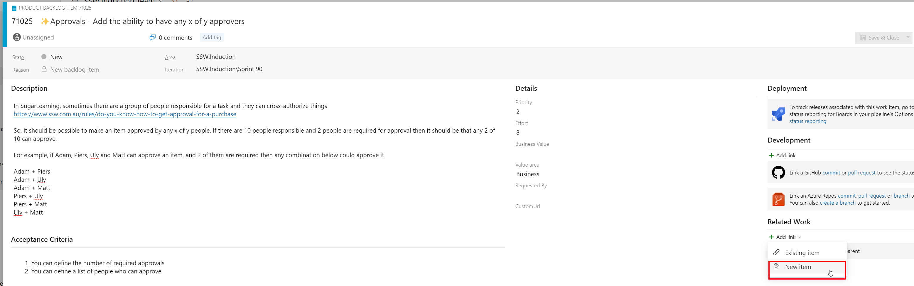
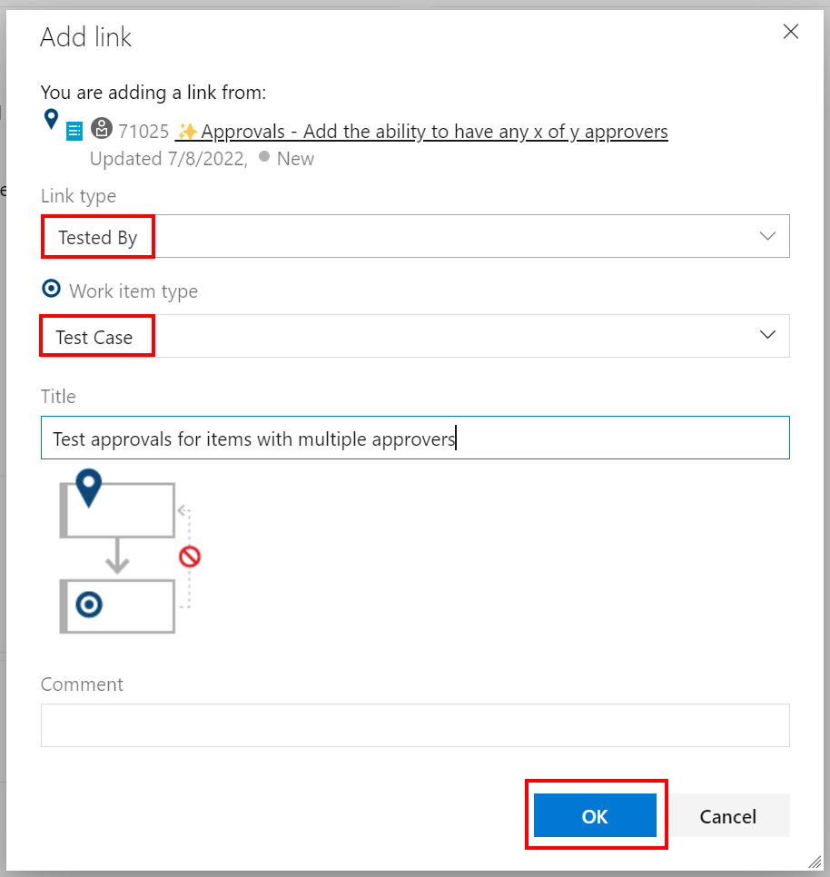
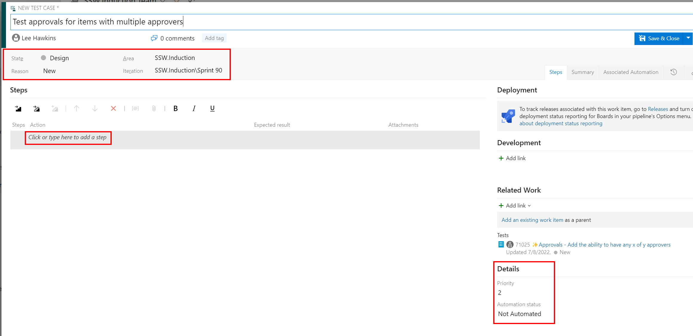
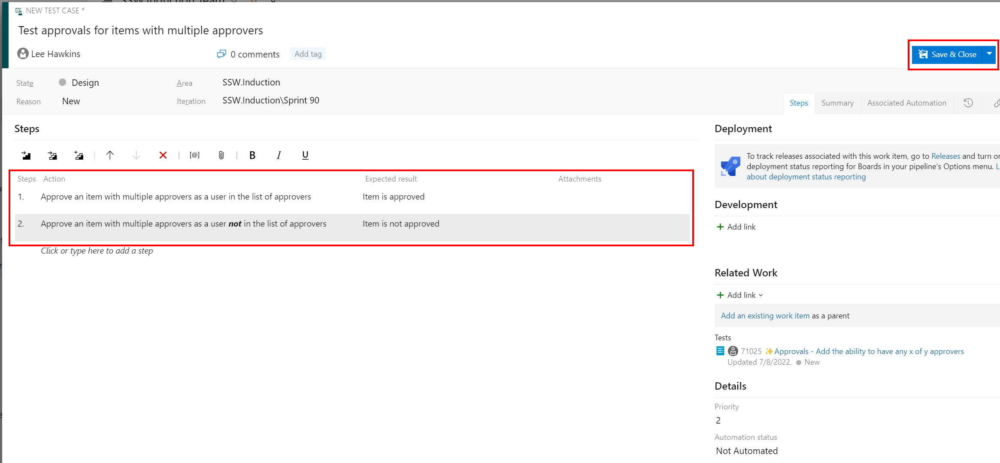

You can create a test case in Azure Test Plans directly from a Work Item (e.g. a Product Backlog Item or Bug) and also from a Test Plan or Test Suite.

<!--endintro-->

## Creating a test case from a Work Item

You can create a new test case from any list of work items (e.g. a Sprint Backlog).

## Creating a test case from a Test Plan or Test Suite

re-use most of the above steps, maybe just split out the launch points into this and make rest generic?

** REMEMBER TO DO THIS Add your rule to a category