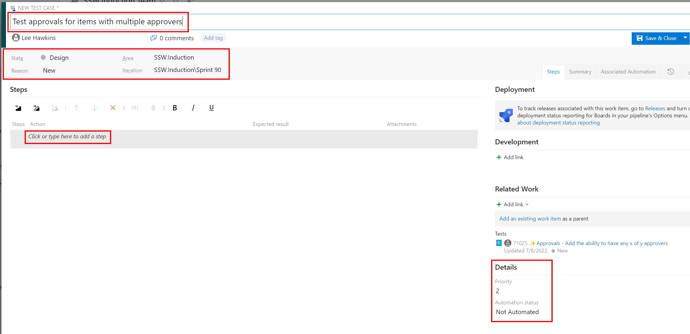

You can create a test case in Azure Test Plans directly from a Work Item (e.g. a Product Backlog Item or Bug) and also from a Test Plan or Test Suite.

<!--endintro-->

## Creating a test case from a Work Item

You can create a new test case from any list of work items (e.g. a Sprint Backlog).

## Creating a test case from a Test Plan or Test Suite

You can also create a new test case from a Test Plan or Test Suite.

