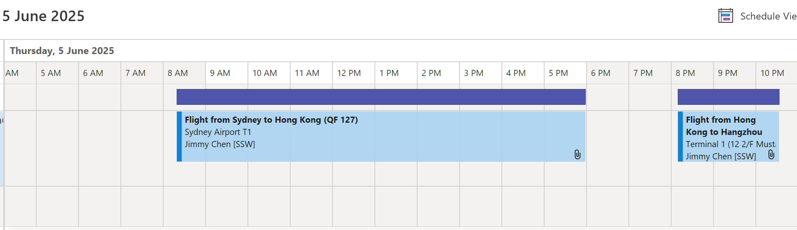
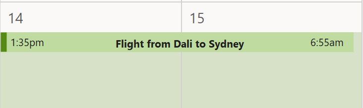

Once you've [booked a flight](/do-you-know-how-to-book-better-flights/), it's important to keep track of it so everyone who needs to know can find the relevant details.

<!--endintro-->

This is how you should create an appointment in the Outlook calendar for flights:

* Enter all of the flight details into the appointment. Use the ariplane emoji in the subject, and include your name, from/to, and the flight number. E.g. **"✈️ Adam Cogan - SYD -> BNE - QF 500 - 08 May 10:20 AM"**
* If someone is picking you up, include the arrival time and invite any relevant parties
* When possible, always include the terminal number in the location field. If a non-standard terminal, make it extra clear
  E.g. Jetstar flights should have highlighted: "WARNING: Different terminal. Allow more time".
* Make sure to include any unusual information about the flight
  E.g. "You are not flying with your preferred airline because {{ REASON }}..." OR "As per our conversation, you are flying via Melbourne, because {{ REASON }}..."
* Always include the price of the ticket in the message
* Do not forget to categorize the appointment as CONFIRMED RED so it cannot be overbooked
* Always create more than 1 appointment for flights that have more than one leg (connecting flights)

::: good

:::

::: bad

:::

Here is a template to follow:

::: email-template  

|          |     |
| -------- | --- |
| To:      | {{ RELEVANT PARTIES }} |
| Event Name: | ✈️ {{ PERSON }} - {{ FROM -> TO (e.g. SYD -> BNE) }} - {{ FLIGHT NUMBER }} - {{ DATE AND TIME }} |
| Location: | {{ TERMINAL NUMBER }}  |
| Status: | 🔴 Busy  |
::: email-content  

### Hi {{ RELEVANT PARTIES }}  

I am flying to {{ DESTINATION }}
Booking number: {{ BOOKING NUMBER }}

This flight cost is {{ COST }}

**Departure**

* {{ AIRPORT }} {{ TERMINAL }}
* {{ DEPARTURE DATE AND TIME }}

**Arrival**

* {{ DESTINATION AIRPORT }} {{ TERMINAL }}
* {{ ARRIVAL DATE AND TIME }}

On arrival, I will get a train to my accommodation.

\< This is as per [https://www.ssw.com.au/rules/create-appointment-for-flights](/create-appointment-for-flights) \>

:::  
:::  
