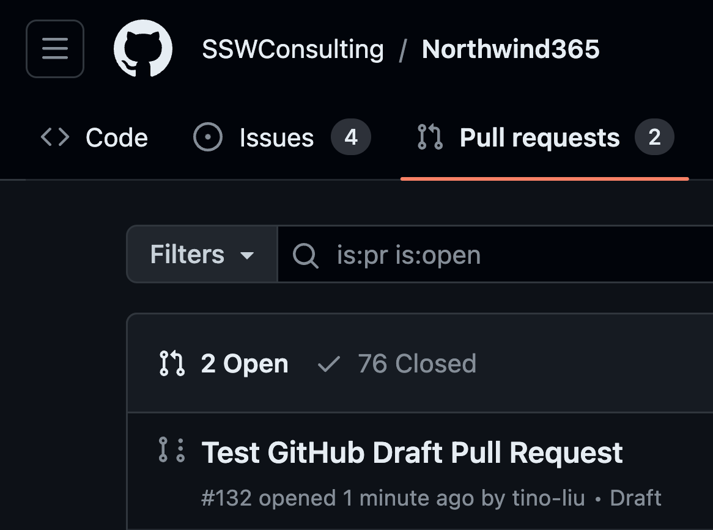
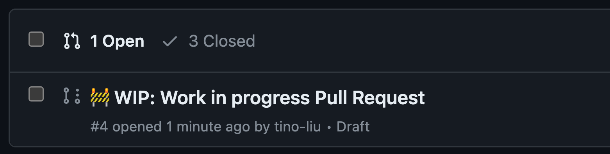
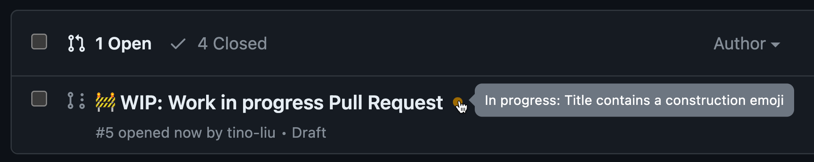
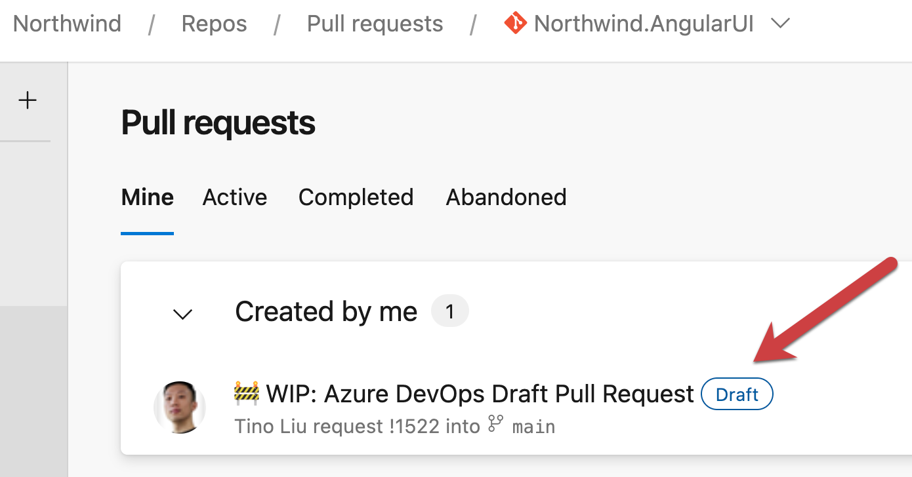

The use of draft pull requests is a handy practice to indicate work in progress promoting early collaboration and continuous feedback.
This approach enhances code quality, reduces duplication, and helps to maintain a transparent and efficient development pipeline.

Draft pull requests are less effective if they are not clearly marked as Draft, as is the case on GitHub. To make them clearer, use a naming convention like `❌ WIP: {{PR Title}}` to clearly show that it is a draft pull request.

### GitHub

::: bad

:::

::: good

:::

If you want to go one step further, you can add the [WIP App](https://github.com/marketplace/wip) to your repo. The WIP App prevents the merging of Pull Requests with "WIP" in their title.

::: good

:::

### Azure DevOps

::: good

:::
