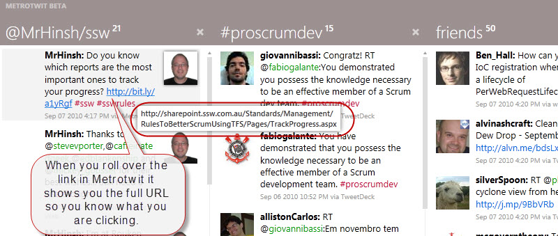

Readability of URLs is important, so you should consider making a short URL. However, it is not just making the length as short as possible - it should be friendly. 

<!--endintro-->

If you use a unfriendly link people can't see what they are clicking through to. In fact, this is what most spammers rely on.

::: greybox
blogs.msdn.com/b/briankel/archive/2010/06/25/now-available-visual-studio-2010-rtm-virtual-machine-with-sample-data-and-hands-on-labs.aspx
:::
::: bad
Bad example - People can’t easily type or remember this URL... it is too long and hard to clearly see what it will take you
:::

::: greybox
Thanks Rob, that is great.
Made a bit.ly at http&#58;//bit.ly/aC5Lb2 as per http&#58;//ssw.com.au/rules/do-you-know-to-make-short-urls-readable-where-you-can
:::
::: ok
OK examples - Short URLs, but hard to remember 
:::

When you can, take the more readable option:

::: greybox
Thanks Rob, that is great.
Made a bit.ly at http&#58;//bit.ly/VS-2010-VM as per http&#58;//ssw.com.au/rules/create-friendly-short-urls 
:::
::: good
Good examples - Short URLs, easier to remember  
:::

So you should only 'Auto Shorten URLs' when it is too long and you need the space.

However, it is becoming more prevalent for the software to support showing the full URL on rollover.

::: good  
  
:::
