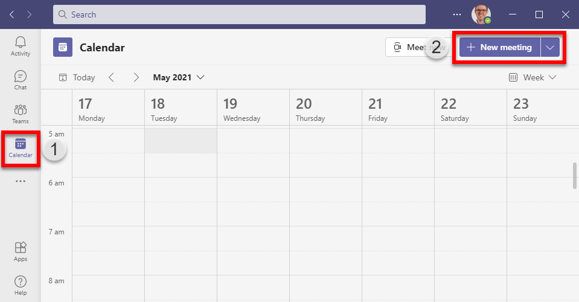
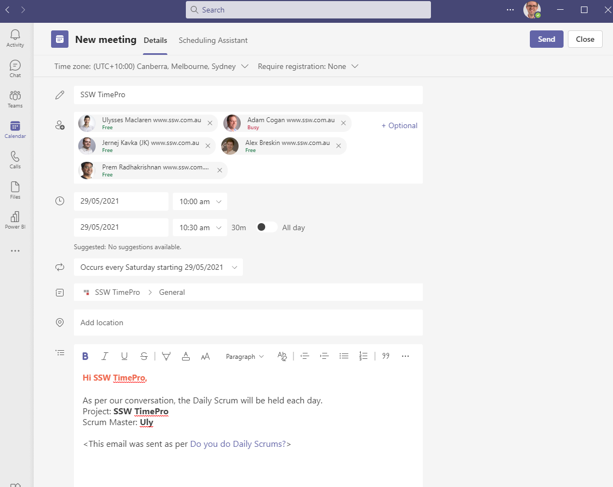

Everyone in your organisation should be able to see meetings that are relevant to their team. Recurring meetings must be setup correctly so that they are associated with a team channel. This process lets others in your organisation see the meetings associated with that channel.

1. Navigate to Microsoft Teams | Calendar | New Meeting

2. Enter the details of the meeting, make sure to add a channel to associate with it!

3. Hit save and you are done, your meeting is all setup.

