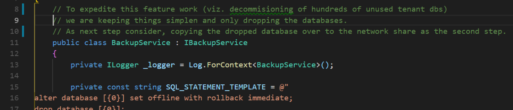
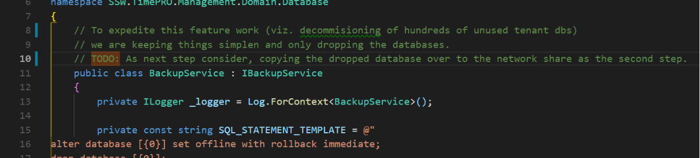
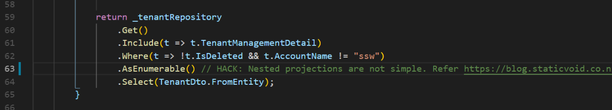

​​Task List comments can be used to indicate a variety of work to be done at the location marked, including: 
<ul><li>features to be added; </li><li>problems to be corrected;</li><li>classes to implement;</li><li>place markers for error-handling code;</li><li>reminders to check-in the file.  </li></ul> 
 <excerpt class='endintro'></excerpt> 

As with other Task List entries, you can double-click any comment entry to display the file indicated in the Code Editor and jump to the line of code marked. More details for <a href="https://www.ssw.com.au/SSW/Redirect/MSDN2/TaskListcomments.htm">Task List comments</a>. 

 
<dd class="ssw15-rteElement-FigureBad">​​Figure: Bad example - the comment doesn't show in Task List window</dd>
​

 
<dd class="ssw15-rteElement-FigureGood">Figure: Good example - Marked TODO in the comment, so you can see it in Task List window and double-click to jump to</dd>
​ 

 
<dd class="ssw15-rteElement-FigureGood">Figure: Good example - Marked HACK in the comment, so you can see it in Task List window and double-click to jump to</dd>

<dl class="goodImage"><dt>​ </dt></dl>

