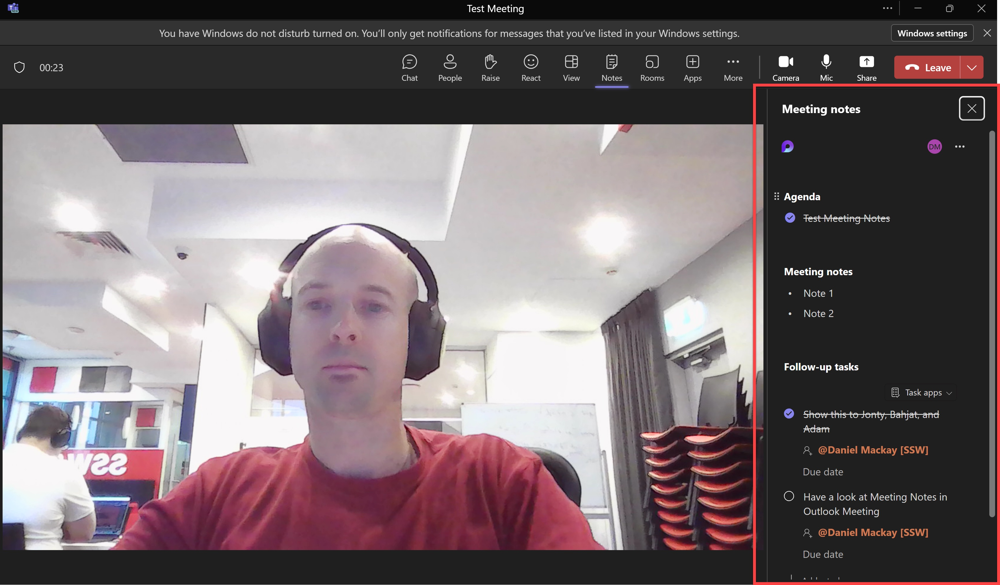
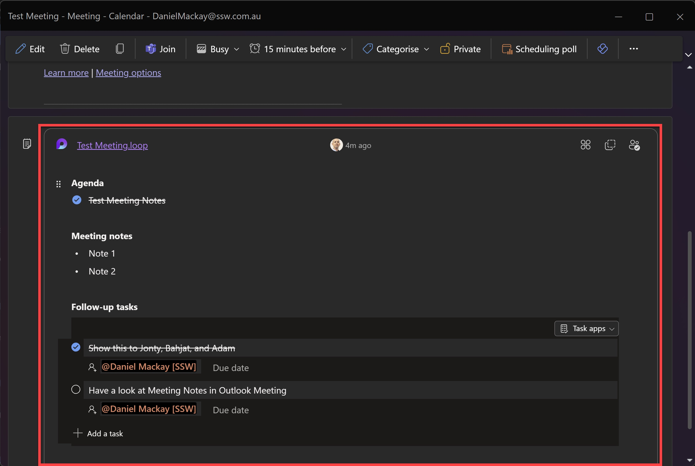

The aim of most meetings should be to come up with next steps. These should be shared with the intended recipient, as well as CCing all other attendees.

It is a good idea to have a scribe who is drafting the action points during the meeting and **assigning them directly to those responsible for completing the tasks**. If it's not already clear who the scribe is, say "Who will be the scribe?" at the beginning of any meeting. And now in Microsoft Teams, when in a meeting, the scribe can use the **Notes** tab to add details and list follow-up tasks during the meeting.

::: good

:::

The meeting organiser should allow time after the meeting to check the action points before their next meeting. This can seen as a summary page at the end of the meeting.

::: good

:::

The scribe should also document the decision-making process by writing down each person's arguments. After everyone comments on the options, the notes can be reviewed as a group and often the best course of action is clear. 

Common action items include:

<!--endintro-->

* The outcomes from agenda points marked as “for decision”
* [Off topics that require more discussion](/keep-track-of-a-parking-lot-for-topics) by subsets of the meeting’s attendees – aka a “parking lot”
* Ad hoc tasks that come up from brainstorming, usually sent as separate email tasks or created as PBIs in a backlog
* A date scheduled for the next meeting (if needed)