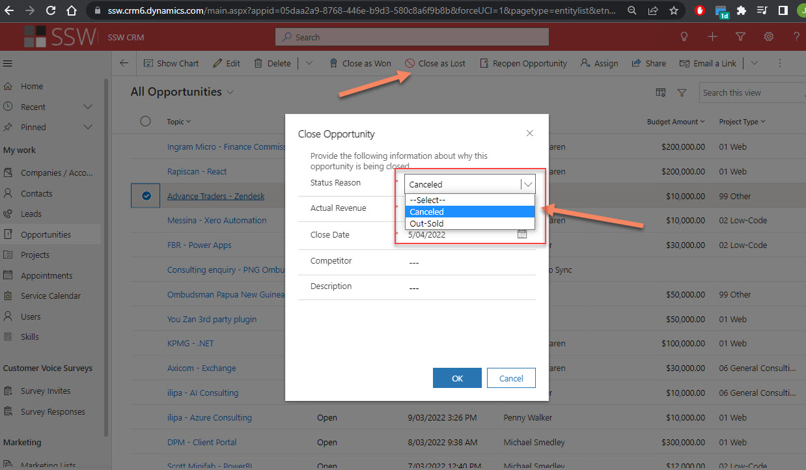

Losing opportunities is very common for a business. Keeping track of the win/lost ratio is a good start if you want to track how you're doing, but making sure you keep a close look on what you've lost more important why, is critical.

<!--endintro-->

## The basics

There are a number of reasons you may lose an opportunity: The project may be cancelled, you may be too expensive or out-sold, or maybe you simply don't have the capacity to cater for bookings.

If you want to report on lost opportunities, the first step is to make sure Sales have the opportunity to do so. Make sure you provide a field with enough options when closing an opportunity:

::: bad

:::

::: good

:::

Once the information is stored in CRM, you can then easily report on it, e.g. using PowerBI or any other reporting tool. This provides great insights to make educated business decisions (i.e. "should we hire more?")

## Going the extra mile

Reporting is great, but this may come back through your feedback loop a bit too late. If you want to be alerted when you just lost a big opportunity because you don't have enough staff, you can go the extra mile and setup alerting based on conditions.

The best way to do so is to setup a LogicApp to trigger when an opportunity has been lost, setup your filters (e.g. Budget Amount >= $100,000 and Reason = "Not enough staff") and you're done!