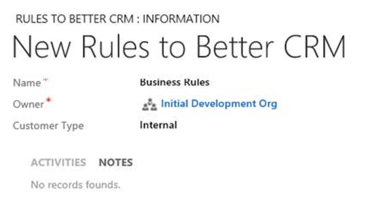
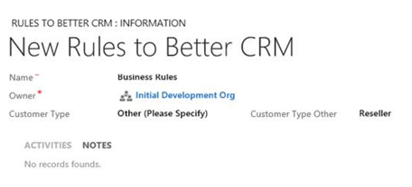

Prior to CRM 2013 if a CRM user wanted to:

* Show an error message
* Set a field value
* Set business required
* Set field visibility (show/hide fields)
* Lock or unlock a field

They would normally need to get a CRM developer involved to write JavaScript code to automate these actions.

Starting with CRM 2013 (and much improved in CRM 2015), users can now use Business Rules to automate these actions without getting a CRM developer involved.

<!--endintro-->

Take the following Example:
<dl class="image">&lt;dt&gt; 
       
   &lt;/dt&gt;<dd>Figure: ‘Customer Type Other’ should be hidden and only displayed when Other is selected</dd></dl>
To make this work use the following Business Rules:
<dl class="image">&lt;dt&gt; 
       
   &lt;/dt&gt;<dd>Figure: Show the ‘Customer Type Other’ field when Customer Type equals Other</dd></dl>
The flip side of the expression also needs to be set where Customer Type doesn’t equal Other to hide the ‘Customer Type Other’ field (you could also optionally clear this field too)
<dl class="image">&lt;dt&gt; 
       
   &lt;/dt&gt;<dd>Figure: Hide the ‘Customer Type Other’ field when Customer Type doesn’t equal Other </dd></dl>
Finally the last step is to      **Activate** the Business Rules. To activate click the activate button on the top right of the tool bar.

Now the form will look like this:
<dl class="image">&lt;dt&gt; 
       
   &lt;/dt&gt;<dd>Figure: Great. Now ‘Customer Type Other’ is hidden</dd></dl><dl class="image">&lt;dt&gt; 
       
   &lt;/dt&gt;<dd>Figure: And on the other side ‘Customer Type Other’ is visible</dd></dl>
**Note:** CRM 2015 further improves on this by introducing the if… else… construct, so instead of creating two business rules (one for show and one for hide), this rule can be reduced to just one.
