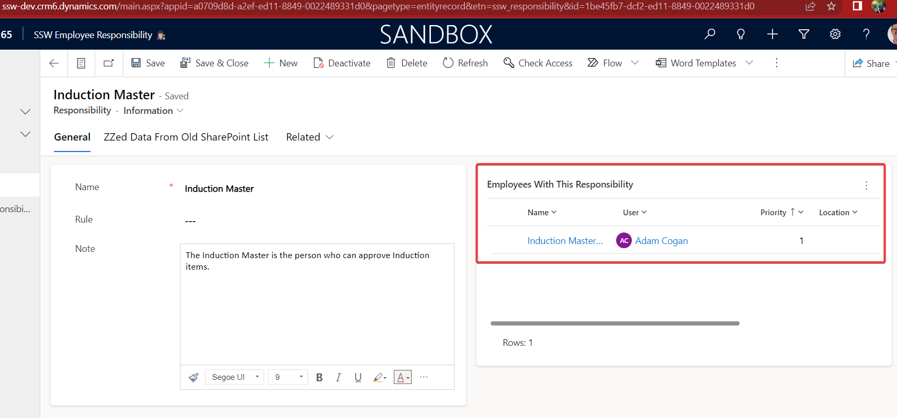
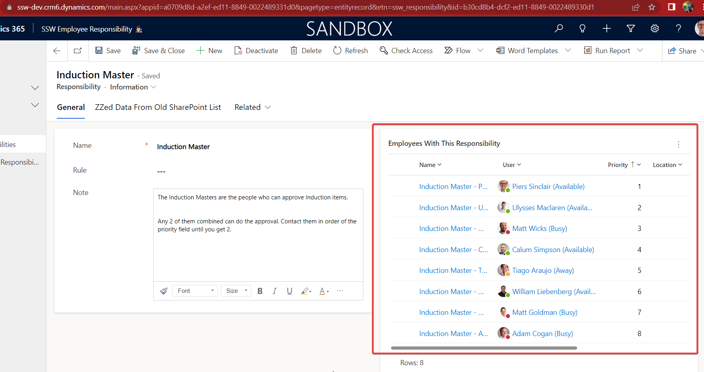

In small companies, a single key stakeholder often approves everything, ensuring alignment with the organizational vision and strategy. However, as the company grows, this can lead to bottlenecks. To address this, one strategy is to create an employee responsibility, which lists the people responsible for a specific approval. This list creates a clearly communicated system for [cross-authorization](https://www.ssw.com.au/rules/purchase-please/#cross-authorization).

<!--endintro-->

## Benefits of scaling approvals
✅ Significant time savings for the person causing the bottlenecks (aka the "original approver")

✅ Fewer bottlenecks for those seeking approval

✅ Consistent and high-quality approvals

## Developing the system
There are 4 steps to developing the new system of approvals.

1. Identify - Find tasks causing "approval hell" aka bottlenecks
2. Assign - Appoint trusted subject matter experts to be responsible
3. Classify - Determine the importance of the task
4. Implement - Document and induct the new approvers
5. Monitor - Keep track of each employees' responsibilities

### 1. Process - Identify tasks causing "approval hell"
Before being able to fix "approval hell", problem tasks need to be identified. For example, there might be delays in approval for induction completion.

### 2. Assign - Appoint trusted subject matter experts to be responsible
Start building out a list of people who are experts on that subject. Those people will become the ones responsible for approvals.

Once the list is compiled, assign each person a priority. That determines the order to contact people.

Tip: Set the "original approver" as the lowest priority to minimize their involvement.

### 3. Classify - Determine the importance of the task
Some tasks are more valuable than others, which means the level of quality check required will be different. For example, a task to fix spelling mistakes probably doesn't matter as much as something like deleting invoices. Therefore, you would assign more approvers to the task for deleting invoices.

Figuring out the right number of approvals can be difficult, generally the idea is to reduce the amount of approvals as much as possible without sacrificing on quality or risk.

Here are some guidelines:

#### 0 Approvals
The gold standard is to look for a way to remove approvals entirely. This can usually be done for common sense fixes by using tools like Grammarly and ChatGPT. For example, you may decide that any spelling mistake fix can be applied to the company induction system, as long as it has been verified by Grammarly.

In these cases, a 3rd party tool acts as the approver.

#### 1 Approval
Tasks that require 1 approval are usually well-documented, routine processes. In that case, the standard acts as the second approver since it is assumed that it has been followed.

An example of a task that might require 1 approval is a routine leave request.

#### 2 Approvals
2 approvals is for tasks that fall into one of the following cateogires:
* They do not follow a well-documented process
* They frequently have variations from the process
* They are of high importance

In these cases, a 2nd approval is valuable because:

✅ It establishes confidence in the process

✅ A second perspective results in less mistakes slipping through

✅ A single approver may make a rushed or bad decision

✅ The approvers hold each other accountable

A company wide email is an example of a task which might require 2 approvals, because it is very disruptive to other personnel.

#### 3+ Approvals or leave with the "original approver"
When an approval is of critical importance to the business, it is worth considering if it should be approved by a "council" of people, or alternatively by the "original approver". These are tasks where a mistake could be catastrophic for the business. For example, opening a new office might require 3 approvals, because it is a highly expensive and risky task.

### 4. Implement - Document and induct the new approvers
The final step is to record all the established decisions and induct the new approvers.

1. Induct each person by having them shadow the "original approver" for at least 3 approval processes, ensuring they understand the goal.
2. Document the new approvers in a central repository, naming it {{ APPROVAL }} Masters.
3. Create a template in the Teams Approvals app to ensure a standard process is followed.
4. Update the standard so that instead of contacting the "original approver", individuals use the Teamps approval template and contact the new approvers in order until they get the required number of approvals as determined when classifying the importance of the task.

### 5. Monitor - Keep track of each employees' responsibilities
One problem with this system is responsibility creep! When someone is a trusted individual within the company they can end up with too many responsibilities causing new bottlenecks.

To prevent this issue, create reports which track the number of approvals people are doing. That way if someone has too many you can reallocate some of them.

## Keeping Approvers Aligned
Sometimes approvers may run into a controversial approval or they may be unsure about how to handle an approval. When that happens, they should call in the "original approver" to help resolve the problem.

Approvers may also have disagreements about how to handle an approval. Disagreements between 2 approvers can be solved as follows: 

1. The 2 approvers should have a call to get aligned about how to solve the problem.
2. If they still cannot agree, they should call in a 3rd approver to mediate.
3. If they still cannot agree, then the original approver should act as arbiter

To keep everyone on the same page, make sure to have a call to get aligned on how to address the problem. If those approvers still can't agree, 

::: bad  
  
:::

::: good  
  
:::

## Communicating the streamlined approvals process
This process should ideally be implemented across all business bottlenecks. However, identifying the most problematic approvals can be challenging. 

To solve this, communicate the new approval process company-wide, encouraging employees to suggest areas for implementation. This crowdsourcing approach should yield valuable feedback on where to apply the streamlined approval process.

