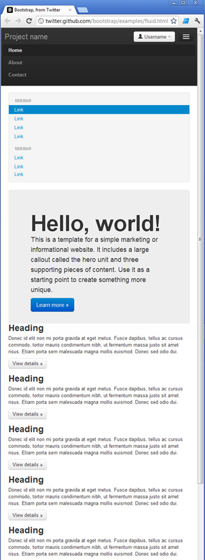

Efficient programmers do not re-invent the wheel. That's why we [use the best Web UI libraries](/do-you-use-the-best-web-ui-libraries).

Bootstrap is a NuGet Package that provides a jump-start for HTML based projects. It includes the HTML, CSS and JavaScript framework used to build the Twitter site.

<!--endintro-->

Building your site on top of Bootstrap makes it much easier to have your website look great on devices of all sizes, across many different browsers.

Read our [Rules to Better UI (Bootstrap)](/rules-to-better-ui-bootstrap).

::: bad  
  
:::

::: good  
  
:::

## Documentation

[Bootstrap on GitHub](https://github.com/twbs/bootstrap).

## Framework integrations

One of the benefits of using Bootstrap over a library such as [Shadcn](https://ui.shadcn.com) is that it's widely supported across a large number of Front end frameworks. Take a look at the following Bootstrap integrations for example:

* [BootstrapVue](https://bootstrap-vue.org)
* [Angular](https://ng-bootstrap.github.io/#/home)
* [React Bootstrap](https://react-bootstrap.netlify.app)

While you can use Bootstrap without any framework specific integrations, using one of the libraries can save you a lot of time managing your css classes and writing boilerplate code while building your Interface. The front end frameworks listed above are ultimately just wrappers for using Bootstrap, which is little more than a CSS library. This means that you can use Bootstrap with any front end framework of your choosing. You can even use it for static html pages provided that you include links to the required JavaScript and CSS files in your pages. This can be achieved by adding a link to bootstrap's [CDN](https://getbootstrap.com) in your pages.

## Tailwind

Alternatively, [TailwindCSS](https://tailwindcss.com) is also acceptable. The difference between the Tailwind and Bootstrap is a matter of how comfortable you are with CSS.

Out of the box, Tailwind is lightweight and will get the job done simply; you can build a website without ever having to look at CSS.

Bootstrap requires theme customization, but it’s more robust and solid once done. [Read more about these differences](https://themesberg.com/blog/design/tailwind-css-vs-bootstrap).
