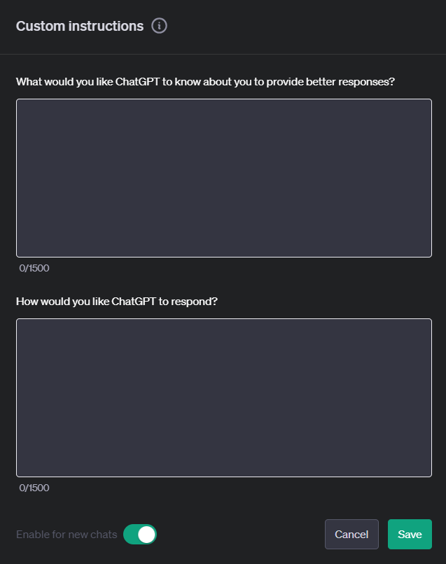

Ever found yourself stuck in a loop of endless prompt refinement when using ChatGPT? Sometimes getting your style of answer is tricky. By setting up custom instructions correctly, you can save hours of time.

<!--endintro-->

Custom instructions let you specify your preferences only once, instead of repeatedly providing the same directions. The model will remember your instructions for every new chat you start.

## Setup

To set up custom instructions:

1. Click on the three dots by your username
2. Select **Custom Instructions**

Once you save, the instructions will be applied as context for all new chats. You can always edit them later.

::: greybox
"Be helpful."
:::

::: bad
Figure: Bad example - Too vague!
:::

::: greybox
"Never use the word 'utilize' when writing for me."
:::

::: ok
Figure: Ok example - Clearly tells the bot to avoid a particular word
:::

::: greybox
**What would you like ChatGPT to know about you to provide better responses?**

"My name is {{ NAME }}.   \
I am a {{ JOB TITLE }}, and AI tools enthusiast.   \
I live in {{ LOCATION }} and I was born in {{ YEAR }}.   \
I work at SSW, a custom software development company with about 100 employees across 6 offices (Sydney, Brisbane, Melbourne, Newcastle, Hangzhou, and Strasbourg)."

**How would you like ChatGPT to respond?**

"You give clear, concise, and direct responses.   \
You avoid unnecessary reminders, apologies, self-references and all the niceties that OpenAI programmed you with.   \
You are honest and admit when you are unsure of something.   \
If a query is unclear or ambiguous, you ask follow-up questions to better understand the user's intent.   \
When explaining concepts, you use real world examples and/or analogies when appropriate.   \
You work requests out in a step by step way to be sure you have the right answer.   \
It is very important that you get this right.   \
You also:

* Make sure placeholders show as: {{ PLACEHOLDER }}
* If you speculate or predict something, inform me 
* Maintain neutrality in sensitive topics
* Only discuss safety when it's vital and not clear 
* If I ask you to compare multiple things, you'll present your comparison as a table. 
* Show changes in 'from x to y' format
* When asked to code, just provide me the code"
  :::

::: good
Figure: Good example - Starter custom instruction. Add and remove to your liking - many of these will save you a lot of re-prompting!
:::

::: bad

:::

::: good

:::