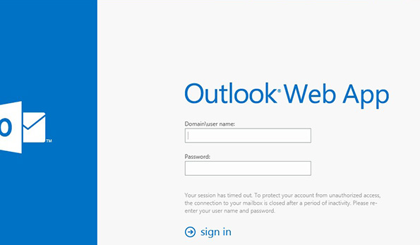
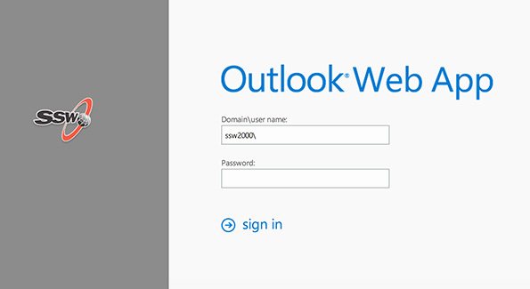

It is possible to customise OWA, for example you can add change the colouring and add your company logo to the OWA logon page.

<!--endintro-->

::: bad
   
:::
::: good

:::

The following Microsoft article explains how to customise OWA: [Customize the Outlook Web App Sign-In, Language Selection, and Error Pages](http://technet.microsoft.com/en-us/library/ee633483%28v=exchg.150%29.aspx).

2. Place your content here. Markdown is your friend. See this [example rule](https://www.ssw.com.au/rules/rule) for all the things you can do with Rules.
3. Submit your rule for review.
4. Add your rule to a category. See [How to Add and Edit Categories and Top Categories](https://github.com/SSWConsulting/SSW.Rules.Content/wiki/How-to-Add-and-Edit-Categories-and-Top-Categories).
