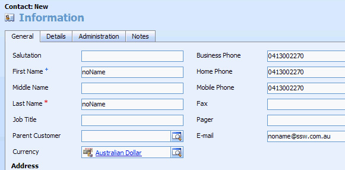
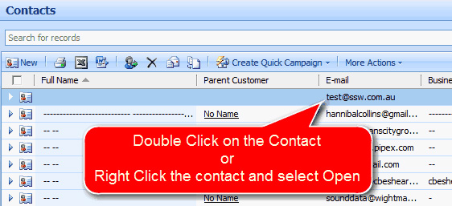

Out of the box CRM4 only enables a contact to have 3 phone numbers (home, business and mobile) + 3 email addresses (but only one visible). A customization that almost everyone needs is to remove this limitation (to allow contacts to have an unlimited amount of phone numbers and email addresses). 
<!--endintro-->
<dl class="badImage">          &lt;dt&gt;
            
          &lt;/dt&gt;
          <dd>Figure: Bad example - Out of the box a contact can only have 3 phone numbers and
              1 email address</dd>
        </dl>
There are a few customizations needed to get the SSW Contact Makeover:

* Show some hidden fields
* Make some form changes to move to a new tab
* Make a CRM frame (to add in a subform)
* Add some entities
* Add some form java script to hide the core Contact Details? tab when a user is             entering a new contact

<dl class="goodImage">          &lt;dt&gt;
            
          &lt;/dt&gt;
          <dd>Figure: Good example - Enable the hidden fields and move it to a new tab. And now
              a Contact has 3 email addresses and phone numbers </dd>
        </dl><dl class="goodImage">          &lt;dt&gt;
            
          &lt;/dt&gt;
          <dd>Figure: Good example - After adding an entity, you add a frame show the unlimited
              contact details (phone, fax, email etc)
          </dd>
        </dl>
Q: So what is the end result? 
A: The end user experience to add a phone number is ..
<dl class="image">          &lt;dt&gt;
            
          &lt;/dt&gt;
          <dd>Figure:  Step 1: Double-click the contact (or right-click the contact and
              select Open) Open</dd>
        </dl><dl class="image">          &lt;dt&gt;
            
          &lt;/dt&gt;
          <dd>Figure:  Step 2: Select the tab 'More Contact Details' </dd>
        </dl>
<dl class="image">          &lt;dt&gt;
            
          &lt;/dt&gt;
          <dd>Figure:  Step 3: Click the button 'New Contact Detail' </dd>
        </dl><dl class="image">          &lt;dt&gt;
            
          &lt;/dt&gt;
          <dd>Figure:  Step 4: Enter the details and click button 'Save and Close' (top
              left) </dd>
        </dl>
