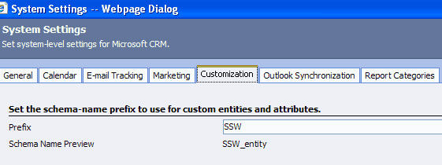

Note when you do a customization it gives it a prefix with the schema name - in           our case SSW. With this prefix you can easily distinguish customized attributes           from default attributes.

<!--endintro-->
<dl class="image">          &lt;dt&gt;
            &lt;/dt&gt;
          <dd>
            Figure: Set your schema-name prefix to use for custom entities and attributes</dd>
        </dl><dl class="image">          &lt;dt&gt;
            &lt;/dt&gt;
          <dd>
            Figure: customized attributes with the prefix</dd>
        </dl>
