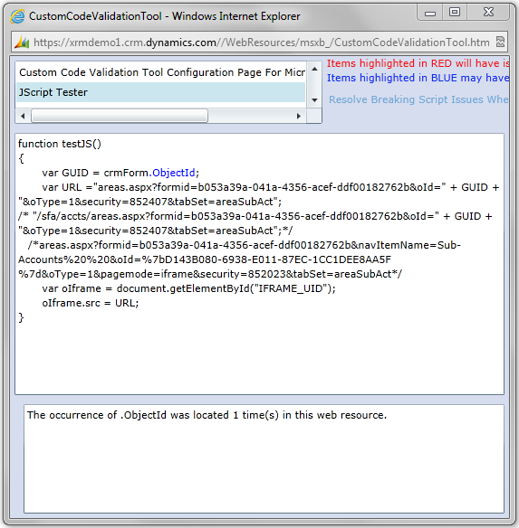

​As of the December 2012 Service Update (online) and Rollup 12 (on-prem) CRM HTML Components (HTC) are disabled by default. This means any JavaScript that references the V4 API will fail. Using the CRM Custom Code Validation Tool will help you to track down this legacy code and update it. It is not recommend to  re-enable the HTC controls as it will just create more problems down the track.
 <excerpt class='endintro'></excerpt> 

​

To use the CRM 2011 Custom Code Validation Tool, download the zip file from Microsoft and install the solution into CRM2011. Once installed in CRM you will be able to run the validation tool over the custom JavaScript. Issues in red highlight deprecated functions and should be fixed immediately, issues in blue are uses of undocumented functions, while not as important they should also be checked.

 

Figure: Using Custom Code Verification Tool

Download the CRM 2011 Custom Code Validation Tool from: <a href="http://www.microsoft.com/en-us/download/details.aspx?id=30151">http://www.microsoft.com/en-us/download/details.aspx?id=30151</a>

 

