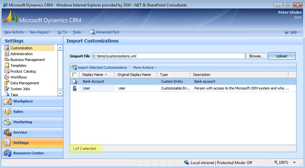

Export each single entity customization and keep each entity customization in a separate file, like:

* Account_11022009.xml
* Contact_11022009.xml

<!--endintro-->

This way, if an entity is changed or broken on the Live environment, you can re-import the customization for this entity again, without breaking other entities on live environment.

Instead of exporting each single entity, you can also export only your customized entities in 1 step, and afterwards select what entities to import

