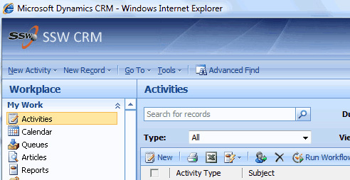

 
​​
          The name of default CRM logo is 'masthead.jpg' which is located under directory
          '_imgs' of the CRM web folder. To customize it, rename this file to, say, 'masthead_backup.jpg' and
          put your company logo named​ as ''masthead.jpg'. Done!
         

 <excerpt class='endintro'></excerpt> 
<dl class="goodImage">
          <dt>
            
          </dt>
          <dd>
            Figure: Change CRM company logo</dd>
        </dl>

