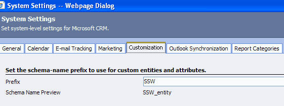
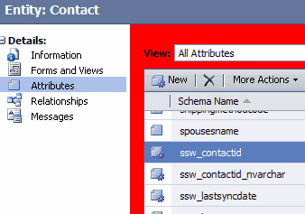

          Note when you do a customization it gives it a prefix with the schema name - in
          our case SSW. With this prefix you can easily distinguish customized attributes
          from default attributes.
        

 <excerpt class='endintro'></excerpt> 
<dl class="image">
          <dt>
            </dt>
          <dd>
            Figure: Set your schema-name prefix to use for custom entities and attributes</dd>
        </dl>
        <dl class="image">
          <dt>
            </dt>
          <dd>
            Figure: customized attributes with the prefix</dd>
        </dl>

