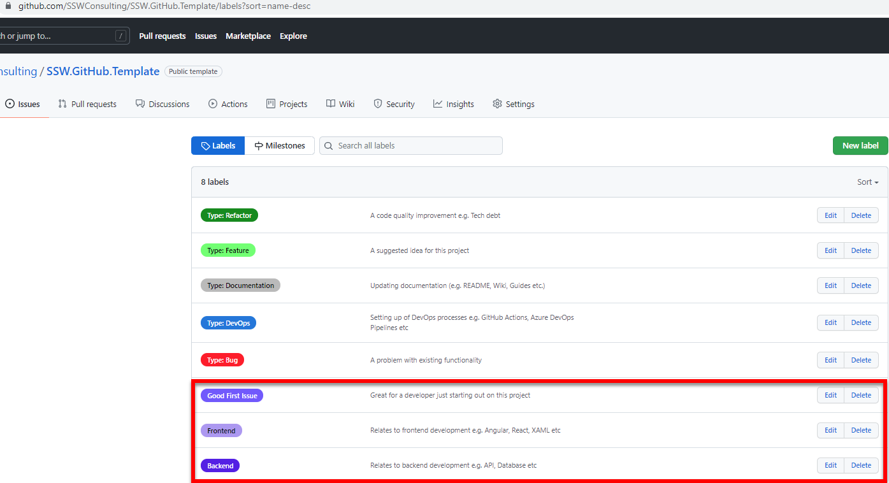

The goal is that you use consistent labels across all your repos. 

<!--endintro-->

**Note:** When you use \[issue templates](/do-you-have-the-best-github-issue-template) you should set the label.

