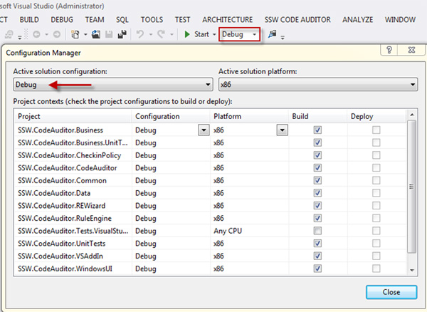

Debug compilation considerably increases memory footprint since debug symbols are required to be loaded.

Additionally it will hit the performance because that will include the optional debug and trace statements in the output IL code.

<!--endintro-->

In debug mode the compiler emits debug symbols for all variables and compiles the code as is. In release mode some optimizations are included:

* unused variables do not get compiled at all
* some loop variables are taken out of the loop by the compiler if they are proven to be invariants
* code written under #debug directive is not included etc.

The rest is up to the JIT.

As per:     [C# debug vs release performance](http://stackoverflow.com/questions/2446027/c-sharp-debug-vs-release-performance).
<dl class="badImage">&lt;dt&gt;
      
   &lt;/dt&gt;<dd>Figure: Bad Example</dd></dl><dl class="goodImage">&lt;dt&gt;
      
   &lt;/dt&gt;<dd>Figure: Good Example</dd></dl>
We have a program called [SSW Code Auditor](http://www.ssw.com.au/ssw/CodeAuditor) to check for this rule.
