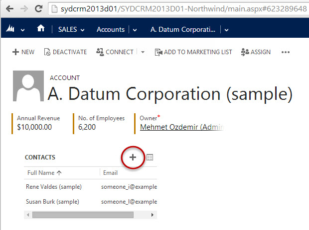

**Tip #1:** Avoid duplicates - Search to see if the Contact already exists before creating it.

 **Tip #2:** Generally you should be [creating these from leads](/Pages/Leads-can-be-converted-to-Opportunities-Contacts-and-Accounts.aspx), as it speeds up the process.

<!--endintro-->
<dl class="badImage">&lt;dt&gt; 
       &lt;/dt&gt;<dd>Figure: Bad Example - Click New, enter relevant contact information, and click "Save and Close"</dd></dl><dl class="goodImage">&lt;dt&gt;
      
   &lt;/dt&gt;<dd>Figure: Good Example - open the Account and create the contact from there</dd></dl>
