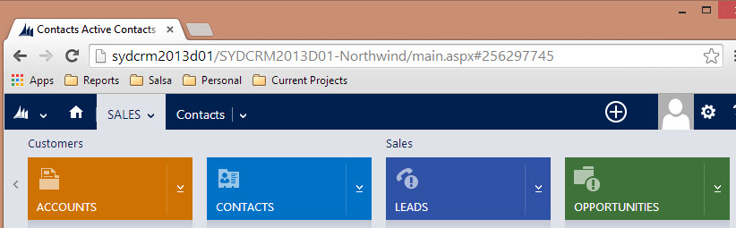

You need to know what's in the sales pipeline, and the way to do that is by entering a potential sale and it's value.
 **
** 

 **Note:** In order to enter new Opportunities into CRM, the company the Opportunity belongs to must already exist. 

<!--endintro-->
<dl class="goodImage">          &lt;dt&gt;
            
          &lt;/dt&gt;
          <dd>
            Figure: In CRM 2013, click on Sales | Opportunities</dd>
        </dl><dl class="goodImage">          &lt;dt&gt;
            
          &lt;/dt&gt;
          <dd>
            Figure: Click New, enter the Opportunity, especially the $ value and the chance of success</dd>
        </dl>
