Regular users or data entry personnel should be able to use your data entry form with ease. The form should follow a logical sequence of steps that matches the expectations they have based on their past experiences. This user experience will help to maximise their efficiency and satisfaction.

<!--endintro-->

`youtube: https://www.youtube.com/embed/l2qCRsz69JI`

**Video: Mastering Web-Based Data Entry: A UX Handbook | Toby Churches | SSW Rules (6 min)**

### Use descriptive button labels

Forms should clearly indicate how a button will affect the page's state. For instance, a "close" button alone can be ambiguous; it's unclear whether it will apply or discard changes.

To avoid confusion, provide buttons for every possible state change and make ["cancel" less obvious](/do-you-make-your-cancel-button-less-obvious/). For example, include 3 buttons:

* **"Save"** - Saves the form without closing it
* **"Save and close"** - Saves and closes the form
* **"Cancel"** - Closes the form without saving

Furthermore, ensure state-based actions are [labelled consistently](/label-buttons-consistently/) across the application so that users always know what to expect.

::: bad  
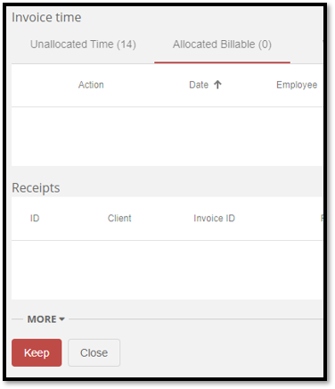  
:::

::: good  
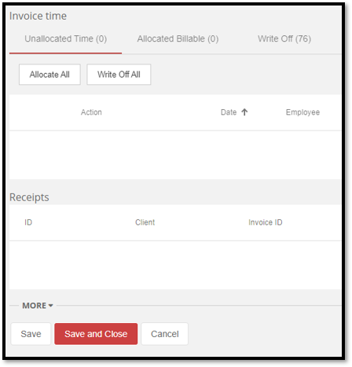  
:::

### Test UI Responsiveness

With the diversity of modern devices used to access web-based applications, responsive design is an essential part of form development, ensuring that the fields can be accessed. Generally, the size of the form field should also be indicative of the amount of data it should possess.

Consider the following Questions:

* Is the form resizable? 
* What happens if the user resizes and/or maximizes the form? 
* What if the user is using their mobile phone or tablet?

For more information, read about [making webpages work on mobiles and tablets](/responsive-design) and [providing alternate sizings for Bootstrap columns](/do-you-provide-alternate-sizings-for-bootstrap-columns).

::: bad  
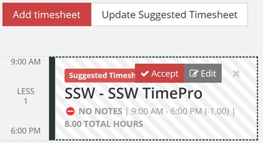  
:::

::: good  
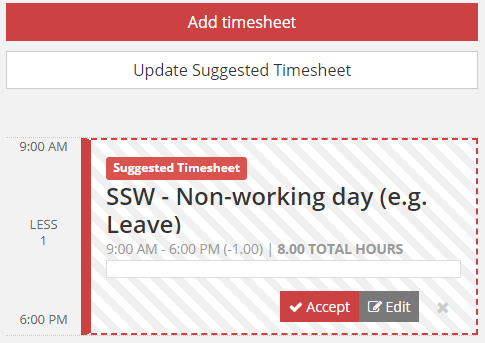  
:::

### Field formatting

Field formatting is essential for a good UX. Ensure that the data is displayed in a logical manner based on the datatype of the input. always consider the usecase of the data being conveyed, but here are some guidelines to get you started:

* The size of the field should be similar to the expected size of the data
* Numerical values contain the least amount of decimal places to convey the information required
  * For example: On an invoice you need to provide very precise figures, so you would need to use 2 decimal places. However, on a sales report you may not use any decimal places as it is just to convey the general trend of dollars to management.
  * The frontend converts the database format into a human readable format e.g. 2 decimal places
* Numerical values have right-alignment
* Currency and Percentage fields contain relevant numerical symbols i.e. '$' or '%'

::: info
**Note:** This format conversion can be difficult for data-bound fields. Luckily, many frameworks such as Angular provide convenient methods for handling such situations. In the following code extract, an example of Angular pipes can be seen to format the currency and percentage fields.
:::

``` html
<div>
  <!-- When amount = 10 , output = '$ 10.00' -->
    <p>Currency: {{ amount | currency}}</p>

    <!-- When percentage = 0.1 , output = '10.00 %' -->
    <p>Percentage: {{ percentage | percent: '1.2-5'}}
</div>
```
**Figure: Code - Angular Pipes for formatting data**

Alternatively, this could be done by triggering a transformation method in the TypeScript file with event binding. This would ensure that the input field would be reformatted when modified.

See more on [arranging forms](/do-you-know-how-to-arrange-forms) and [aligning form labels](/how-to-align-your-form-labels).


::: bad  
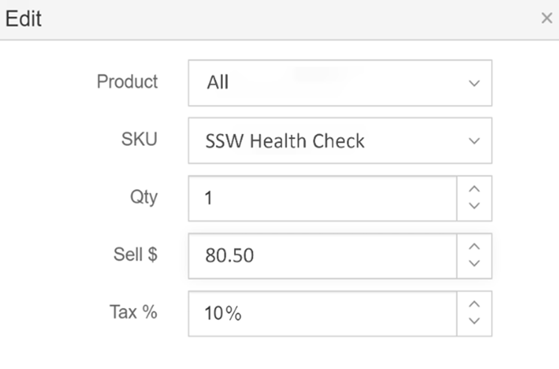  
:::

::: good  
  
:::

### Use auto-populated fields when possible

Populating fields with default values, such as pulling data from system time, enhances data entry efficiency and user satisfaction by reducing trivial and repetitive data entry. However, when opening a new form, only prepopulate fields unlikely to change, such as sales tax. If you want the user to consider a field, don't prepopulate it by default.

::: good  
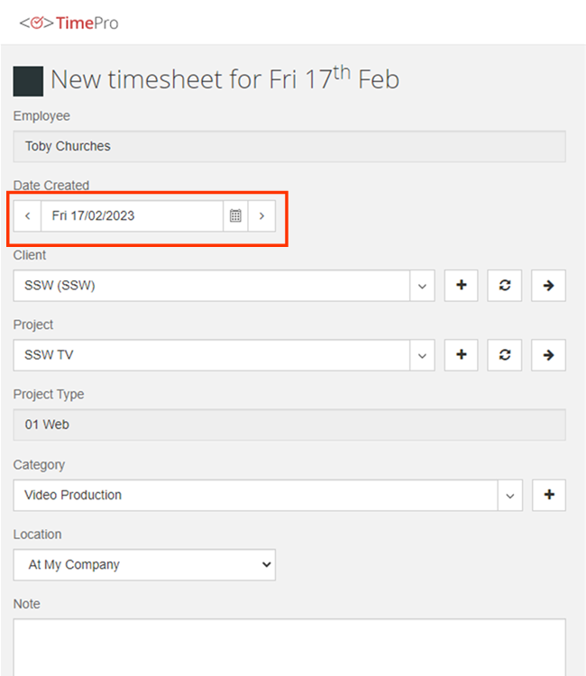  
:::


### Use Validation

Validation is essential for any form development, with the majority of fields requiring validation of some description. The 3 main categories of validation include:

* **Required** - The field should be filled in
* **Formatting** - The field must be in the correct format. e.g. currency or date
* **Logical** - The field needs to pass some validation tests in the business layer

Tip for long forms: the desired behaviour for when a validation error occurs is to take the user back to the improper field via a scrolling motion. This is particularly important for mobile devices where the responsive layout may cause the form to be extended, requiring further effort to identify the issue. 

::: good  
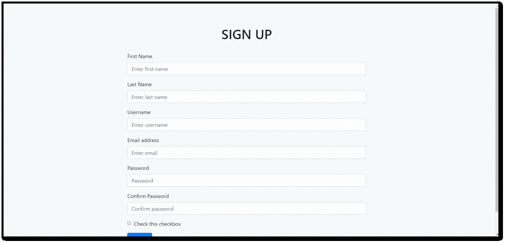  
:::

### Show "created by" and "updated by" fields

For the purposes of logging and change history, it is highly recommended that the following information is maintained:

* **Date Created** - The date on which the record was created
* **Employee Created** - The employee responsible for its creation 
* **Date Updated** - The date on which the record was last updated
* **Employee Updated** - The employee that last updated the record 

This will assist with accountability, allowing users to quickly see information about recent changes.

Additionally, these fields of the form should remain "Read only" ensuring that the data is accurate and reliable.

::: bad  
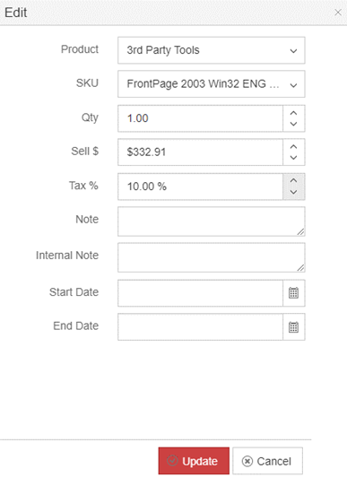  
:::

::: good  
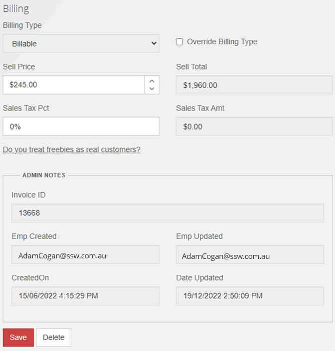  
:::

### Avoid "Delete" button for item lists

For a list of items that is used for searching for individual records, the user shouldn't be given the option to **delete** from the grid. Instead, they should have to open the individual record to be presented with the option to "Delete" the data. This forces the user to examine all of the information before deleting.

::: bad  
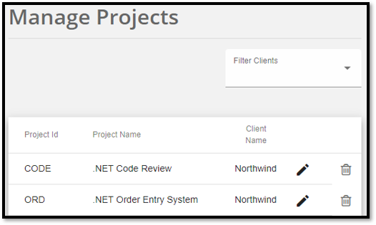  
:::

::: good  
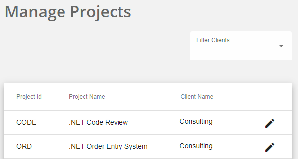  
:::

However, this rule is contextual. For instances where the importance of the data is trivial or all of the necessary information is immediately presented within the grid, it would be acceptable to include a "Delete" button on the grid.

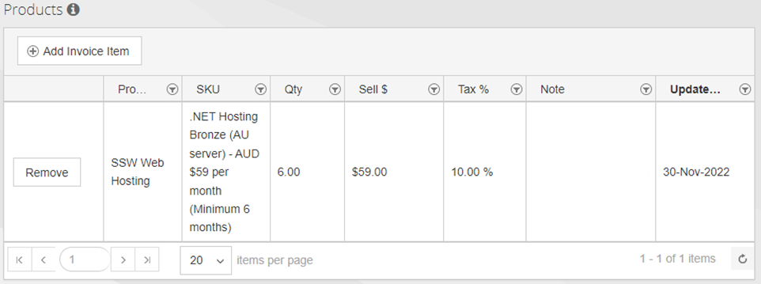  
