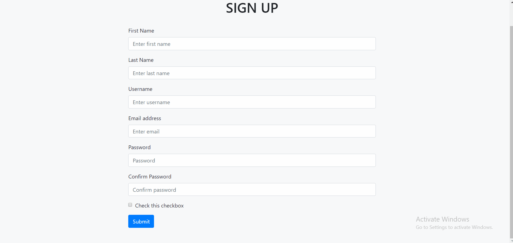
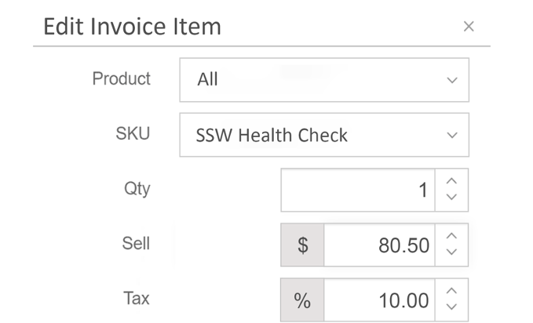
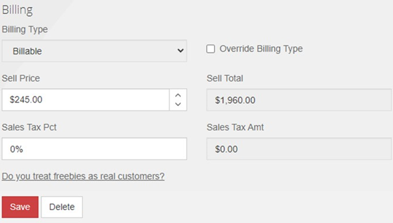

Data entry personnel should be able to use your data entry form with ease. The form should follow a logical sequence of steps that matchjes the expectations they have based on their past experiences. This user experience will help to maximise their efficiency and satisfaction.

<!--endintro-->

### Form states and how to respond to them

Forms should clearly indicate how a button will affect the page's state. For instance, a "close" button alone can be ambiguous; it's unclear whether it will apply or discard changes.

To avoid confusion, provide buttons for every possible state change. For example, instead of a "close" button include three buttons:

* "Save": Saves the form without closing it.
* "Save and close": Saves and closes the form.
* "Cancel": Closes the form without saving.

Furthermore, ensure state-based actions are [labelled consistently](/label-buttons-consistently/) across the application so that users always know what to expect.

::: bad  
  
:::

::: good  
  
:::


### No delete button for item lists

For a list of items that is used for searching for individual records, the user shouldn't be given the option to "Delete" from the grid. Instead, they should have to open the individual record to be presented with the option to "Delete" the data. This forces the user to examine all of the information before deleting.

::: bad  
  
:::

::: good  
  
:::

However, this rule is contextual. For instances where the importance of the data is trivial or all of the necessary information is immediately presented within the grid, it would be acceptable to include a "Delete" button on the grid.

::: good  
  
:::

### Validation

Validation is essential for any form development, with the majority of fields requiring validation of some description. The 3 main categories of validation include:

* Required - The field should be filled in
* Formatting - The field must be in the correct format. e.g. currency or date
* Logical - The field needs to pass some validation tests in the business layer

Furthermore, the desired behaviour for when a validation error occurs is to take the user back to the improper field via a scrolling motion. This is particularly important for mobile devices where the responsive layout may cause the form to be extended, requiring further effort to identifty the issue. 

::: good  
  
:::

You should also [put focus to the correct control on validation error](/using-field-validation). 

### Field formatting

With the various requirements of different forms, field formatting is essential, ensuring that the data is displayed in a logical manner for the particular input. To guarantee consistency across your data entry forms, we suggest that the following conventions are followed:

* Numerical values contain decimal places
* Numerical values have right-alignment
* Currency and Percentage fields contain relevant notation (i.e. '% xx.xx') 
* Data is converted into the database standard format before being saved

::: bad  
  
:::

::: good  
  
:::

**Note:** This format conversion can be difficult for data-bound fields. Luckily, many frameworks such as Angular provide convenient methods for handling such situations. In the following code extract, an example of angular pipes can be seen to format the currency and percentage fields.

``` html
<div>
    <!-- When amount = 10 , output = '$ 10.00' -->
    <p>Currency: {{ amount | currency}}</p>

    <!-- When percentage = 0.1 , output = '10.00 %' -->
    <p>Percentage: {{ percentage | percent: '1.2-5'}}
</div>
```
**Figure: Code - Angular Pipes for formatting data**

Alternatively, this could be done by triggering a transformation method in the TypeScript file with event binding. This would ensure that the input field would be reformated when modified.

### Created/last updated by fields

For the purposes of logging and change history, it is highly recommended that the following information is maintained:

* **DateCreated** - The date on which the record was created
* **EmployeeCreated** - The employee responsible for its creation 
* **DateUpdated** - The date on which the record was last updated
* **EmployeeUpdated** - The employee that last updated the record 

This will assist with accountability, allowing users to quickly see information about recent changes.

Additionally, these fields of the form should remain 'Read only' ensuring that the data is accurate and reliable.

::: bad  
  
:::

::: good  
  
:::

### Minimum defaults

In many situations, there is a need for field defaults. These defaults can be extracted from an existing data object or a dynamic source (such as the system time). These values increase the efficiency of data entry and improve the overall user satisfaction, allowing trivial or repetitive entries to be automatically filled. 

However, when a new form is opened ensure that only necessary defaults are loaded. By default, some decimal fields will become '0.0', but make sure they are set to blank if they are required fields.

### Responsiveness

Is the form resizable? What happens if the user resizes and/or maximizes the form? What if the user is using their mobile phone or tablet?

With the diversity of modern devices used to access web-based applications, responsive design is an essential part of form development, ensuring that the fields can be accessed. Generally, the size of the form field should also be indicative of the amount of data it should possess.

For more information, read about [making webpages work on mobiles and tablets](https://www.ssw.com.au/rules/design-web-pages-to-work-on-mobile-and-tablets-screens-aka-responsive-web-design/) and [providing alternate sizings for Bootstrap columns](/do-you-provide-alternate-sizings-for-bootstrap-columns/).
