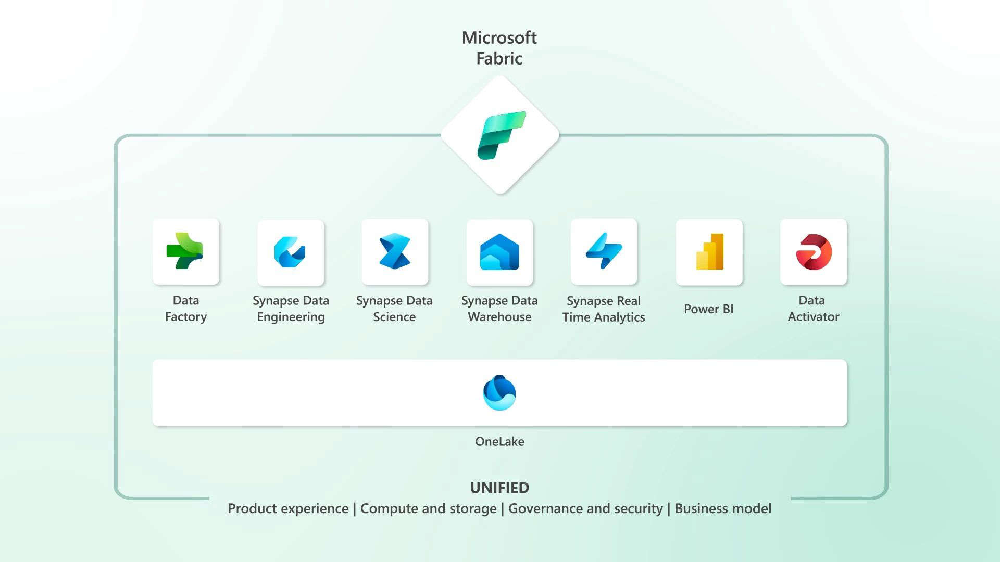

Imagine running a business without a clear, unified view of your data. Here's what you might face:

1. **Data Silos:** Different departments hoard their data, making it difficult to gather holistic insights about your business.
2. **Inefficiency:** You spend valuable time integrating data from disparate sources instead of generating insights.
3. **Cost Overruns:** Managing multiple systems for data integration, engineering, warehousing, and business intelligence inflates your costs.
4. **Impaired Decision Making:** Inconsistencies and lack of access to all data hinder informed decision-making.

Typically, companies managed this problem with Data Warehouses like having a SQL Server database to aggregate all their data.

These days, [data lakes](/understanding-data-lakes) make it easy to consolidate all data in an unstructured manner.

<!--endintro-->

::: img-medium

:::

### The Solution - A Data Lake

A data lake serves as a single source of truth for all company data, helping to solve the above problems.

### The Power of Microsoft Fabric

`youtube: X_c7gLfJz_Q`
**Video: Microsoft Fabric: Satya Nadella at Microsoft Build 2023 (1 min)**

[Microsoft Fabric](https://azure.microsoft.com/en-us/blog/introducing-microsoft-fabric-data-analytics-for-the-era-of-ai/) can supercharge your data lake. Fabric integrates technologies like Azure Data Factory (for Extract, Transform, Load - ETL), Azure Synapse Analytics (for data warehousing), and Power BI (for reporting) into a single unified product, empowering data and business professionals alike to unlock the potential of their data and lay the foundation for the era of AI. 🤖

1. **Seamless Integration with Microsoft 365:** Microsoft Fabric can turn your Microsoft 365 apps into hubs for uncovering and applying insights, making data a part of everyday work
2. **Unified Capacities, Reduced Costs:** Microsoft Fabric unifies computing capacities across different workloads, reducing wastage and costs
3. **Simplified Management:** It consolidates necessary data provisioning, transformation, modeling, and analysis services into **one user interface**, simplifying data management
4. **Elimination of Data Duplication:** It enables easy sharing of datasets across the company, eliminating data duplication
5. **Smooth Transition:** Existing Microsoft products like Azure Synapse Analytics, Azure Data Factory, and Azure Data Explorer connect seamlessly with Fabric, allowing a smooth transition

#### Microsoft Fabric and AI

Microsoft Fabric integrates neatly with AI, meaning you can leverage tools like Copilot directly from the user interface.

<video controls>
  <source src="https://wus-streaming-video-rt-microsoft-com.akamaized.net/bf4f8032-b937-444a-ae91-a342fd07aa88/d1345772-86d1-4d8c-9ae3-9dbd580d_6750.mp4" type="video/mp4">
  Your browser does not support the video tag.
</video>

**Video: How Microsoft Fabric fits into AI (1 min)**

In conclusion, every company should have a data lake as a single source of truth, enhanced by Microsoft Fabric. It not only solves the pain of managing data in silos but also improves efficiency, reduces costs, and leads to better, data-driven decisions.
